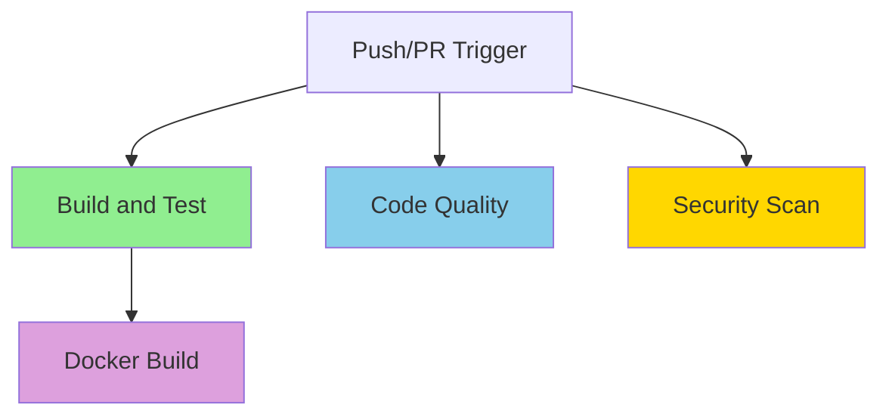

# GitHub Actions CI/CD Pipeline

## Overview

This repository includes a comprehensive CI/CD pipeline using GitHub Actions that automatically builds, tests, and validates the TTS Playback Service on every push and pull request.

## Pipeline Structure

The pipeline consists of four parallel jobs:



## Jobs

### 1. Build and Test

**Purpose**: Compile the C++ service and run the complete test suite

**Steps**:
1. ✅ Checkout code
2. ✅ Install system dependencies (CMake, GCC, PulseAudio, etc.)
3. ✅ Start PulseAudio service
4. ✅ Cache C++ dependencies for faster builds
5. ✅ Build and install dependencies (hiredis, redis++, AMQP-CPP, spdlog)
6. ✅ Install header-only libraries (cpp-httplib, nlohmann/json)
7. ✅ Configure CMake with testing enabled
8. ✅ Build the service
9. ✅ Verify external services (Redis, RabbitMQ, PulseAudio)
10. ✅ Run all 57 integration tests
11. ✅ Upload test results and build artifacts

**Services**:
- **Redis 7**: Cache service on port 6379
- **RabbitMQ 3.12**: Message queue on port 5672
- **PulseAudio**: Audio system (started in pipeline)

**Environment Variables**:
```yaml
RABBITMQ_HOST: localhost
RABBITMQ_PORT: 5672
RABBITMQ_USER: guest
RABBITMQ_PASSWORD: guest
REDIS_HOST: localhost
REDIS_PORT: 6379
CACHE_SIZE: 10
LOG_LEVEL: 2
```

**Test Coverage**: 57 tests across 6 test suites
- Config tests (8)
- Redis cache tests (12)
- RabbitMQ client tests (10)
- Audio player tests (11)
- API server tests (10)
- Integration tests (6)

### 2. Docker Build

**Purpose**: Build and validate the Docker container image

**Steps**:
1. ✅ Checkout code
2. ✅ Set up Docker Buildx
3. ✅ Build multi-stage Docker image
4. ✅ Test the built image
5. ✅ Use GitHub Actions cache for layers

**Dependencies**: Runs after successful build-and-test job

**Image Details**:
- Base: Ubuntu 22.04
- Multi-stage build for minimal size (~200MB final)
- Includes all runtime dependencies
- Tagged with commit SHA

### 3. Code Quality Checks

**Purpose**: Ensure code quality and documentation standards

**Checks**:
1. ✅ No trailing whitespace in source files
2. ✅ Scan for TODO/FIXME comments
3. ✅ Verify required documentation exists
4. ✅ Validate CMakeLists.txt syntax

**Documentation Requirements**:
- [`README.md`](../../README.md)
- [`docs/INDEX.md`](../../docs/INDEX.md)
- [`docs/api/API.md`](../../docs/api/API.md)

### 4. Security Scan

**Purpose**: Identify security vulnerabilities in dependencies and code

**Tools**:
- **Trivy**: Comprehensive vulnerability scanner
- Scans filesystem for known CVEs
- Results uploaded to GitHub Security tab

**Output**: SARIF format for GitHub Security integration

## Triggers

The pipeline runs on:

```yaml
on:
  push:
    branches: [ main, develop ]
  pull_request:
    branches: [ main, develop ]
  workflow_dispatch:  # Manual trigger
```

## Caching Strategy

To speed up builds, the pipeline caches:

1. **C++ Dependencies** (`/usr/local/lib`, `/usr/local/include`)
   - Cache key: `${{ runner.os }}-deps-${{ hashFiles('CMakeLists.txt') }}`
   - Saves ~5-10 minutes per build
   - Invalidated when CMakeLists.txt changes

2. **Docker Layers** (GitHub Actions cache)
   - Speeds up Docker builds significantly
   - Automatic layer caching with Buildx

## Artifacts

The pipeline produces the following artifacts:

| Artifact | Description | Retention |
|----------|-------------|-----------|
| `test-results` | CTest output and logs | 30 days |
| `tts-playback-service-{SHA}` | Compiled binary | 30 days |
| `trivy-results.sarif` | Security scan results | Permanent (Security tab) |

## Build Time

Typical build times:

| Job | First Run | Cached Run |
|-----|-----------|------------|
| Build and Test | ~15 min | ~5 min |
| Docker Build | ~10 min | ~3 min |
| Code Quality | ~30 sec | ~30 sec |
| Security Scan | ~2 min | ~2 min |
| **Total** | **~27 min** | **~10 min** |

## Requirements

### System Dependencies

The pipeline installs these Ubuntu packages:
```bash
build-essential cmake git pkg-config
libpulse-dev libevent-dev libssl-dev
pulseaudio netcat
```

### C++ Dependencies

Built from source:
- **hiredis**: Redis C client
- **redis-plus-plus**: C++ Redis client
- **AMQP-CPP**: RabbitMQ C++ client
- **spdlog**: Fast C++ logging library

Downloaded as headers:
- **cpp-httplib**: HTTP server library
- **nlohmann/json**: JSON parsing library

### External Services

Required for tests:
- Redis 7 (Docker service)
- RabbitMQ 3.12 (Docker service)
- PulseAudio (started in pipeline)

## Troubleshooting

### Common Issues

#### 1. Test Failures

**Symptom**: Tests fail with connection errors

**Solution**: Check service health in workflow logs
```yaml
- name: Verify services are ready
  run: |
    nc -zv localhost 6379  # Redis
    nc -zv localhost 5672  # RabbitMQ
```

#### 2. Cache Issues

**Symptom**: Build takes too long or fails with missing dependencies

**Solution**: Clear cache and rebuild
- Go to Actions → Caches
- Delete the cache entry
- Re-run the workflow

#### 3. PulseAudio Errors

**Symptom**: Audio player tests fail

**Solution**: Ensure PulseAudio starts correctly
```bash
pulseaudio --start --exit-idle-time=-1
pactl info
```

#### 4. Docker Build Failures

**Symptom**: Docker build fails with dependency errors

**Solution**: Check Dockerfile multi-stage build
- Verify builder stage completes
- Check library installation in runtime stage

## Local Testing

To test the pipeline locally before pushing:

### Using Act (GitHub Actions locally)

```bash
# Install act
curl https://raw.githubusercontent.com/nektos/act/master/install.sh | sudo bash

# Run the workflow
act push
```

### Manual Testing

```bash
# Start services
docker run -d -p 6379:6379 redis:7-alpine
docker run -d -p 5672:5672 rabbitmq:3.12-management-alpine

# Build and test
mkdir build && cd build
cmake -DCMAKE_BUILD_TYPE=Release -DBUILD_TESTING=ON ..
make -j$(nproc)
ctest --output-on-failure
```

## Extending the Pipeline

### Adding New Jobs

To add a new job to the pipeline:

```yaml
new-job:
  name: New Job Name
  runs-on: ubuntu-22.04
  needs: build-and-test  # Optional dependency
  
  steps:
  - name: Checkout code
    uses: actions/checkout@v4
  
  - name: Your custom step
    run: |
      echo "Custom logic here"
```

### Adding Deployment

For automatic deployment to staging/production:

```yaml
deploy-staging:
  name: Deploy to Staging
  runs-on: ubuntu-22.04
  needs: [build-and-test, docker-build]
  if: github.ref == 'refs/heads/develop'
  
  steps:
  - name: Deploy to Kubernetes
    run: |
      kubectl apply -f k8s/
```

## Status Badges

Add these badges to your README.md:

```markdown


```

## Security

### Secrets Management

The pipeline uses GitHub secrets for sensitive data:

```yaml
# Add these secrets in repository settings
DOCKER_USERNAME: ${{ secrets.DOCKER_USERNAME }}
DOCKER_PASSWORD: ${{ secrets.DOCKER_PASSWORD }}
```

### Security Best Practices

1. ✅ All dependencies pinned to specific versions
2. ✅ Trivy security scanning enabled
3. ✅ SARIF results uploaded to GitHub Security
4. ✅ No secrets in logs or artifacts
5. ✅ Minimal Docker image (Ubuntu 22.04 base)

## Performance Optimization

### Current Optimizations

1. **Dependency Caching**: Saves ~10 minutes per build
2. **Parallel Jobs**: Code quality and security run in parallel
3. **Docker Layer Caching**: Speeds up Docker builds
4. **Multi-core Compilation**: Uses `make -j$(nproc)`

### Future Improvements

- [ ] Add code coverage reporting (lcov/codecov)
- [ ] Implement matrix builds (GCC/Clang, Debug/Release)
- [ ] Add performance benchmarking
- [ ] Implement automatic versioning and tagging
- [ ] Add deployment to container registry

## Monitoring

### GitHub Actions Dashboard

Monitor pipeline status:
1. Go to **Actions** tab
2. View workflow runs
3. Check job status and logs
4. Download artifacts

### Notifications

Configure notifications in repository settings:
- Email on failure
- Slack integration
- GitHub mobile app

## Contributing

When contributing, ensure:

1. ✅ All tests pass locally
2. ✅ Code follows project style guide
3. ✅ Documentation is updated
4. ✅ No new security vulnerabilities
5. ✅ Pipeline passes on your branch

## Support

For pipeline issues:
1. Check workflow logs in Actions tab
2. Review this documentation
3. Open an issue with `ci/cd` label
4. Contact DevOps team

---

**Pipeline Version**: 1.0.0  
**Last Updated**: October 13, 2025  
**Maintained By**: DevOps Team