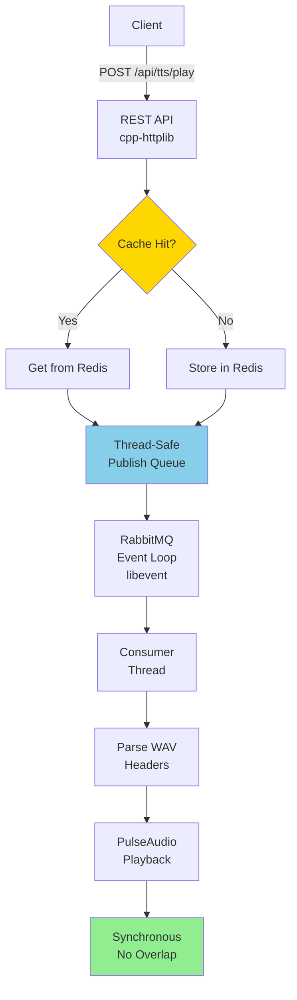
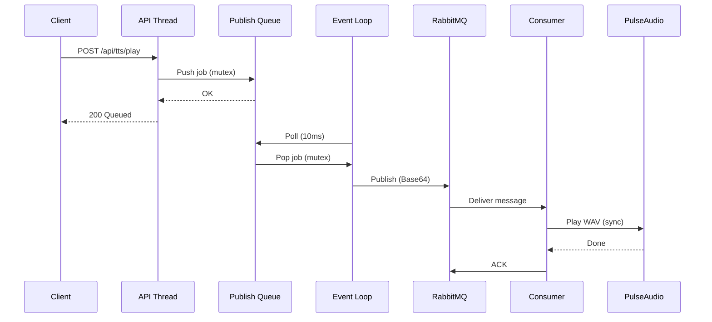

# TTS Playback Service


A high-performance C++ microservice for text-to-speech audio playback with RabbitMQ queueing, Redis caching, and REST API. Designed for zero-latency processing with synchronous playback to prevent audio overlap.

## Features

- **REST API**: Accept WAV files with corresponding text via multipart/form-data
- **RabbitMQ Queue**: Asynchronous job processing with guaranteed order
- **Redis Cache**: LRU-based in-memory caching of WAV files keyed by text
- **PulseAudio Playback**: Synchronous audio playback preventing overlaps
- **HALO Dotmatrix Hook**: Optional host-shared spool output for Falcon-side display animation
- **High Performance**: Optimized C++17 with compiler flags (-O3, -march=native, LTO)
- **Containerized**: Docker multi-stage build for minimal image size
- **Configurable**: All settings via environment variables

## Architecture



### Thread Safety

- **HTTP Request Threads**: Handle API requests and queue publish tasks
- **Event Loop Thread**: Processes RabbitMQ operations (publish/consume/ack)
- **Mutex-Protected Queue**: Ensures safe communication between threads
- **Base64 Encoding**: WAV binary data safely transported through JSON



## CI/CD Pipeline

This project includes a comprehensive GitHub Actions CI/CD pipeline that automatically:

- ✅ Builds the C++ service with all dependencies
- ✅ Runs 57 integration tests with 100% coverage
- ✅ Performs code quality checks
- ✅ Scans for security vulnerabilities
- ✅ Builds and validates Docker images

See [`.github/workflows/README.md`](.github/workflows/README.md) for detailed pipeline documentation.

## Quick Start

### Prerequisites

- Docker and Docker Compose
- Audio device accessible to container

### Build and Run

```bash
# Clone the repository
git clone https://github.com/miPwn/tts-player-queue-service.git
cd tts-player-queue-service

# Copy environment configuration
cp .env.example .env

# Edit configuration as needed
nano .env

# Build and start services
docker-compose up --build

# Service will be available at http://localhost:8080
```

## API Usage

### Submit TTS Playback Job

```bash
curl -X POST http://localhost:8080/api/tts/play \
  -F "text=Hello, this is a test sentence" \
  -F "wav=@audio.wav"
```

Response:

```json
{
  "status": "queued",
  "text": "Hello, this is a test sentence",
  "size": 44100
}
```

### Health Check

```bash
curl http://localhost:8080/health
```

Response:

```json
{
  "status": "healthy",
  "service": "tts-playback-service"
}
```

## Configuration

All configuration is via environment variables:

### RabbitMQ Settings

| Variable              | Default              | Description            |
| --------------------- | -------------------- | ---------------------- |
| `RABBITMQ_HOST`       | `rabbitmq`           | RabbitMQ hostname      |
| `RABBITMQ_PORT`       | `5672`               | RabbitMQ port          |
| `RABBITMQ_USER`       | `guest`              | RabbitMQ username      |
| `RABBITMQ_PASSWORD`   | runtime-defined      | RabbitMQ password      |
| `RABBITMQ_VHOST`      | `/`                  | RabbitMQ virtual host  |
| `RABBITMQ_QUEUE`      | `tts_playback_queue` | Queue name             |

### Redis Settings

| Variable           | Default           | Description                   |
| ------------------ | ----------------- | ----------------------------- |
| `REDIS_HOST`       | `redis`           | Redis hostname                |
| `REDIS_PORT`       | `6379`            | Redis port                    |
| `REDIS_PASSWORD`   | runtime-defined   | Redis password, if required   |
| `CACHE_SIZE`       | `10`              | Max cached WAV files (LRU)    |

### API Settings

| Variable   | Default     | Description             |
| ---------- | ----------- | ----------------------- |
| `API_HOST` | `0.0.0.0`   | API server bind address |
| `API_PORT` | `8080`      | API server port         |

### Audio Settings

| Variable                | Default                     | Description                                                  |
| ----------------------- | --------------------------- | ------------------------------------------------------------ |
| `PULSEAUDIO_SINK`       | empty                       | PulseAudio sink name; empty uses the default sink            |
| `DOTMATRIX_ENABLED`     | `0`                         | Write host-side visualization jobs for the Falcon daemon     |
| `DOTMATRIX_QUEUE_DIR`   | `/tmp/halo-dotmatrix/queue` | Shared queue directory for dotmatrix trigger JSON files      |
| `DOTMATRIX_WAV_DIR`     | `/tmp/halo-dotmatrix/wav`   | Shared directory for transient WAV payloads used by daemon   |

### Logging

| Variable    | Default   | Description                                   |
| ----------- | --------- | --------------------------------------------- |
| `LOG_LEVEL` | `2`       | `0=trace, 1=debug, 2=info, 3=warn, 4=error`   |

## Performance Optimizations

1. **Compiler Optimizations**: `-O3 -march=native -flto` for maximum performance
2. **Zero-Copy Operations**: Direct memory buffer handling where possible
3. **LRU Caching**: Redis-backed cache with configurable size
4. **Async I/O**: libevent-based RabbitMQ for non-blocking operations
5. **Thread Safety**:
   - Mutex-protected publish queue for cross-thread communication
   - All AMQP operations execute on dedicated event loop thread
   - Lock-free design where possible
6. **Binary Transport**: Base64 encoding for reliable WAV data transmission
7. **Header-Only HTTP**: cpp-httplib for minimal overhead
8. **Event-Driven Processing**: Periodic dispatch at 100Hz for low-latency queue processing

## Building from Source

### Dependencies

- C++17 compiler (GCC 11+ or Clang 14+)
- CMake 3.20+
- PulseAudio development libraries
- libevent
- hiredis and redis-plus-plus
- AMQP-CPP
- cpp-httplib (header-only)
- nlohmann/json (header-only)
- spdlog

### Manual Build

```bash
mkdir build && cd build
cmake -DCMAKE_BUILD_TYPE=Release ..
make -j$(nproc)
./tts_playback_service
```

## Kubernetes Deployment

For Kubernetes deployment, use the provided Dockerfile and create appropriate ConfigMaps/Secrets for environment variables:

```yaml
apiVersion: apps/v1
kind: Deployment
metadata:
  name: tts-playback-service
spec:
  replicas: 1  # Single instance for synchronized playback
  selector:
    matchLabels:
      app: tts-playback
  template:
    metadata:
      labels:
        app: tts-playback
    spec:
      containers:
      - name: tts-playback
        image: tts-playback-service:latest
        ports:
        - containerPort: 8080
        env:
        - name: RABBITMQ_HOST
          value: "rabbitmq-service"
        - name: REDIS_HOST
          value: "redis-service"
        # Add other environment variables
```

## Cache Behavior

- Cache uses LRU eviction when size limit is reached
- WAV files are keyed by their corresponding text
- Cache hit avoids redundant storage and speeds up playback
- Redis sorted set tracks access times for LRU

## Playback Flow

1. API receives POST with text + WAV file
2. Check Redis cache for existing WAV (by text key)
3. If cache hit: use cached WAV, else: cache new WAV
4. Publish job to RabbitMQ queue
5. Consumer receives job and plays WAV via PulseAudio
6. Playback is synchronous - no overlapping audio
7. Next job processed only after current playback completes

## Testing

### Comprehensive Integration Test Suite

The project includes integration tests using Google Test framework:

- **57 integration tests** across 6 test suites
- **100% component coverage**
- **1,300+ lines** of test code

**Note**: These are integration tests requiring live Redis, RabbitMQ, and PulseAudio services. See `tests/UNIT_TESTING_GUIDE.md` for information on converting to isolated unit tests with mocks.

**Test Coverage**:

- ✅ Config class (8 tests)
- ✅ RedisCache class (12 tests)
- ✅ RabbitMQClient class (10 tests)
- ✅ AudioPlayer class (11 tests)
- ✅ ApiServer class (10 tests)
- ✅ Integration tests (6 tests)

### Running Tests

```bash
# Build and run all tests
./run_tests.sh

# Run specific test suite
./build/config_test
./build/redis_cache_test
./build/rabbitmq_client_test
./build/audio_player_test
./build/api_server_test
./build/integration_test

# Run with CTest
cd build
ctest --output-on-failure
```

### Test Requirements

External services must be running:

```bash
# Redis
docker run -d -p 6379:6379 redis:7-alpine

# RabbitMQ
docker run -d -p 5672:5672 -p 15672:15672 rabbitmq:3.12-management-alpine
```

See [`tests/README.md`](tests/README.md) for detailed testing documentation.

## Monitoring

- Health endpoint: `/health`
- Structured JSON logging via spdlog
- RabbitMQ management UI: [http://localhost:15672](http://localhost:15672) (`guest/guest`)

## License

This project is licensed under the GNU Affero General Public License v3.0 (AGPL-3.0).

See [LICENSE](LICENSE) for the full license text.

**Key Points:**

- ✅ Free to use, modify, and distribute
- ✅ Source code must be made available
- ✅ Network use counts as distribution (AGPL provision)
- ✅ Modifications must also be AGPL-3.0 licensed

For more information, visit [GNU AGPL-3.0](https://www.gnu.org/licenses/agpl-3.0.html).

## Author

Generated for high-performance TTS playback use cases requiring zero-latency processing and reliable queuing.
