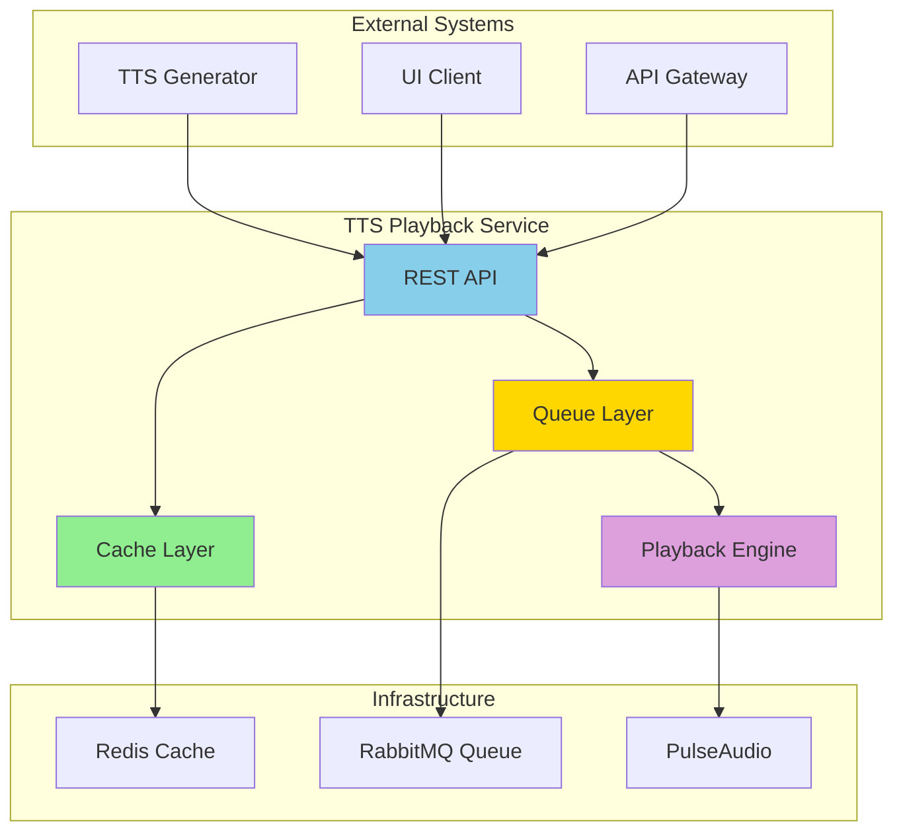
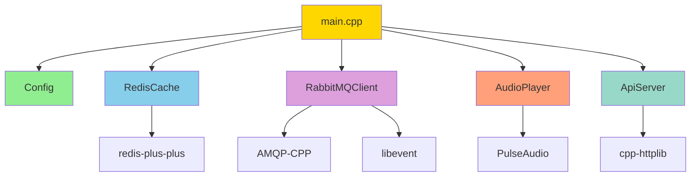
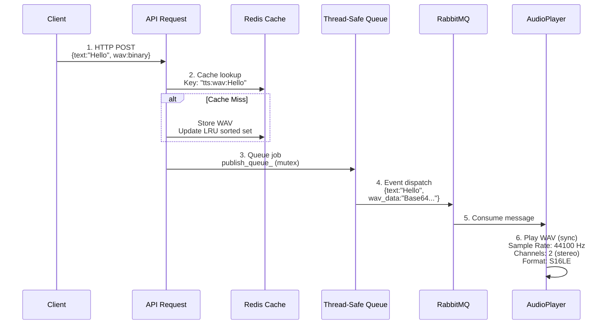

# Architecture Guide

## TTS Playback Service

**Version:** 1.0.0  
**Status:** Production Ready

---

## Table of Contents

1. [Architecture Overview](#architecture-overview)
2. [Component Architecture](#component-architecture)
3. [Data Architecture](#data-architecture)
4. [Integration Architecture](#integration-architecture)
5. [Deployment Architecture](#deployment-architecture)
6. [Scalability Considerations](#scalability-considerations)

---

## Architecture Overview

### System Context Diagram



### Architectural Patterns

#### 1. Producer-Consumer Pattern
- **Producers**: HTTP API handlers
- **Queue**: RabbitMQ message broker
- **Consumer**: Audio playback worker

#### 2. Repository Pattern
- **Repository**: RedisCache class
- **Entities**: WAV audio files
- **Operations**: get(), put(), evict()

#### 3. Event-Driven Architecture
- **Events**: RabbitMQ messages
- **Event Loop**: libevent dispatcher
- **Handlers**: Playback callbacks

#### 4. Layered Architecture
- **Presentation**: REST API
- **Business Logic**: Job handling
- **Data Access**: Cache & Queue
- **Infrastructure**: Audio playback

---

## Component Architecture

### Component Diagram

```mermaid
graph TB
    subgraph "API Layer"
        API[ApiServer<br/>POST /api/tts/play<br/>GET /health<br/>Request validation<br/>Response formatting]
    end
    
    subgraph "Business Logic Layer"
        JOB[Job Handler<br/>Cache check<br/>Job creation<br/>Queue dispatch]
        CONFIG[Config Manager<br/>Env vars<br/>Validation<br/>Defaults]
    end
    
    subgraph "Data Access Layer"
        REDIS[RedisCache<br/>LRU eviction<br/>Binary storage<br/>TTL support]
        RABBIT[RabbitMQClient<br/>Thread-safe<br/>Event dispatch<br/>Base64 encode]
    end
    
    API --> JOB
    API --> CONFIG
    JOB --> REDIS
    JOB --> RABBIT
    
    style API fill:#87CEEB
    style JOB fill:#90EE90
    style CONFIG fill:#FFD700
    style REDIS fill:#DDA0DD
    style RABBIT fill:#FFA07A
```mermaid
graph TB
    subgraph "Infrastructure Layer"
        AUDIO[AudioPlayer<br/>WAV parsing<br/>PulseAudio integration<br/>Synchronous playback<br/>Duration tracking]
    end
    
    RABBIT --> AUDIO
    
    style AUDIO fill:#98D8C8
```

### Component Responsibilities

| Component | Responsibility | Dependencies | Exports |
|-----------|---------------|--------------|---------|
| `Config` | Configuration management | Environment | Config values |
| `ApiServer` | HTTP request handling | cpp-httplib | REST endpoints |
| `RedisCache` | Audio file caching | redis++ | get(), put() |
| `RabbitMQClient` | Message queueing | AMQP-CPP | publish(), consume() |
| `AudioPlayer` | Audio playback | PulseAudio | play() |

### Component Dependencies



---

## Data Architecture

### Data Flow Diagram



### Data Models

#### PlaybackJob
```cpp
struct PlaybackJob {
    std::string text;           // Text content
    std::vector<char> wav_data; // Binary WAV file
};
```

#### TTSRequest (API)
```cpp
struct TTSRequest {
    std::string text;           // Text content
    std::vector<char> wav_data; // Binary WAV file
};
```

#### WAV Header
```cpp
struct WavHeader {
    char riff[4];              // "RIFF"
    uint32_t file_size;        // File size - 8
    char wave[4];              // "WAVE"
    char fmt[4];               // "fmt "
    uint32_t fmt_size;         // Format chunk size
    uint16_t audio_format;     // 1 = PCM
    uint16_t num_channels;     // 1=mono, 2=stereo
    uint32_t sample_rate;      // 44100, 48000, etc.
    uint32_t byte_rate;        // sample_rate * channels * bits/8
    uint16_t block_align;      // channels * bits/8
    uint16_t bits_per_sample;  // 8, 16, 24, 32
    char data[4];              // "data"
    uint32_t data_size;        // Audio data size
} __attribute__((packed));
```

### Data Persistence

| Data Type | Storage | Persistence | Eviction |
|-----------|---------|-------------|----------|
| WAV Files | Redis | In-memory | LRU |
| Job Queue | RabbitMQ | Durable disk | Manual ack |
| Config | Environment | Process lifetime | N/A |
| Logs | stdout/stderr | Container logs | Rotation |

---

## Integration Architecture

### External Integrations

#### 1. Redis Integration

**Connection**:
```cpp
sw::redis::ConnectionOptions opts;
opts.host = config.redis_host;
opts.port = config.redis_port;
opts.password = config.redis_password;
opts.socket_timeout = std::chrono::milliseconds(100);

redis_ = std::make_unique<sw::redis::Redis>(opts);
```

**Operations**:
- `GET tts:wav:{text}` - Retrieve cached WAV
- `SET tts:wav:{text} <binary>` - Store WAV
- `ZADD tts:cache:lru <timestamp> <key>` - Update access time
- `ZRANGE tts:cache:lru 0 0` - Get LRU key
- `DEL tts:wav:{text}` - Delete cached WAV

---

#### 2. RabbitMQ Integration

**Connection**:
```cpp
AMQP::Address address(host, port, AMQP::Login(user, pass), vhost);
connection_ = std::make_unique<AMQP::TcpConnection>(handler, address);
channel_ = std::make_unique<AMQP::TcpChannel>(connection);
```

**Operations**:
- `declareQueue(queue, AMQP::durable)` - Ensure queue exists
- `publish(exchange, routing_key, message)` - Send message
- `consume(queue).onReceived(callback)` - Receive messages
- `ack(deliveryTag)` - Acknowledge processing
- `reject(deliveryTag)` - Reject and requeue

---

#### 3. PulseAudio Integration

**Connection**:
```cpp
pa_sample_spec ss;
ss.format = PA_SAMPLE_S16LE;  // 16-bit signed little-endian
ss.rate = sample_rate;         // From WAV header
ss.channels = num_channels;    // From WAV header

pa_simple* s = pa_simple_new(
    nullptr,                   // Default server
    "TTS Playback Service",    // Application name
    PA_STREAM_PLAYBACK,        // Playback stream
    sink_name,                 // Output device
    "TTS Audio",               // Stream description
    &ss,                       // Sample spec
    nullptr,                   // Channel map
    nullptr,                   // Buffer attributes
    &error
);
```

**Operations**:
- `pa_simple_write(s, data, size, &error)` - Write audio
- `pa_simple_drain(s, &error)` - Wait for completion
- `pa_simple_free(s)` - Cleanup

---

## Deployment Architecture

### Container Architecture

```
┌─────────────────────────────────────────────────────────┐
│                  Docker Container                       │
│                                                         │
│  ┌─────────────────────────────────────────────────┐   │
│  │           tts_playback_service (binary)         │   │
│  │  - Compiled with -O3 -march=native              │   │
│  │  - Statically linked where possible             │   │
│  │  - Minimal runtime dependencies                 │   │
│  └─────────────────────────────────────────────────┘   │
│                                                         │
│  ┌─────────────────────────────────────────────────┐   │
│  │           Shared Libraries                      │   │
│  │  - libpulse.so (PulseAudio)                     │   │
│  │  - libevent.so (Event loop)                     │   │
│  │  - libamqpcpp.so (RabbitMQ)                     │   │
│  │  - libredis++.so (Redis client)                 │   │
│  └─────────────────────────────────────────────────┘   │
│                                                         │
│  Environment Variables:                                │
│    - RABBITMQ_HOST, RABBITMQ_PORT, ...                 │
│    - REDIS_HOST, REDIS_PORT, ...                       │
│    - API_HOST, API_PORT, ...                           │
└─────────────────────────────────────────────────────────┘
```

### Network Architecture

```
                    Internet/Load Balancer
                              │
                              ▼
                      ┌───────────────┐
                      │   Port 8080   │
                      └───────┬───────┘
                              │
┌─────────────────────────────┼─────────────────────────────┐
│                    Container Network                      │
│                             │                             │
│                             ▼                             │
│                  ┌─────────────────────┐                  │
│                  │  TTS Playback       │                  │
│                  │  Service            │                  │
│                  └──────────┬──────────┘                  │
│                             │                             │
│          ┌──────────────────┼──────────────────┐          │
│          ▼                  ▼                  ▼          │
│    ┌──────────┐      ┌───────────┐      ┌──────────┐     │
│    │ Redis    │      │ RabbitMQ  │      │PulseAudio│     │
│    │ :6379    │      │ :5672     │      │  Device  │     │
│    └──────────┘      └───────────┘      └──────────┘     │
│                                                           │
└───────────────────────────────────────────────────────────┘
```

### Kubernetes Architecture

```
┌─────────────────────────────────────────────────────────┐
│                    Namespace: tts                       │
│                                                         │
│  ┌───────────────────────────────────────────────┐     │
│  │              Deployment                       │     │
│  │  ┌─────────────────────────────────────┐     │     │
│  │  │  Pod: tts-playback                  │     │     │
│  │  │  ┌───────────────────────────────┐  │     │     │
│  │  │  │  Container: tts-service       │  │     │     │
│  │  │  │  - Image: tts-playback:1.0    │  │     │     │
│  │  │  │  - Port: 8080                 │  │     │     │
│  │  │  │  - Resources:                 │  │     │     │
│  │  │  │    CPU: 500m-1000m            │  │     │     │
│  │  │  │    Memory: 256Mi-512Mi        │  │     │     │
│  │  │  └───────────────────────────────┘  │     │     │
│  │  └─────────────────────────────────────┘     │     │
│  └───────────────────────────────────────────────┘     │
│                                                         │
│  ┌───────────────────────────────────────────────┐     │
│  │              Service                          │     │
│  │  - Type: ClusterIP                            │     │
│  │  - Port: 8080                                 │     │
│  │  - Selector: app=tts-playback                 │     │
│  └───────────────────────────────────────────────┘     │
│                                                         │
│  ┌───────────────────────────────────────────────┐     │
│  │              ConfigMap                        │     │
│  │  - RABBITMQ_HOST: rabbitmq-service            │     │
│  │  - REDIS_HOST: redis-service                  │     │
│  │  - CACHE_SIZE: "100"                          │     │
│  └───────────────────────────────────────────────┘     │
│                                                         │
│  ┌───────────────────────────────────────────────┐     │
│  │              Secret                           │     │
│  │  - RABBITMQ_PASSWORD: <base64>                │     │
│  │  - REDIS_PASSWORD: <base64>                   │     │
│  └───────────────────────────────────────────────┘     │
└─────────────────────────────────────────────────────────┘
```

---

## Scalability Considerations

### Horizontal Scaling Limitations

**Single Audio Device Constraint**:
- Current design assumes one audio device per service instance
- Multiple replicas would require separate audio devices
- Shared audio device not supported (playback conflicts)

**Recommended Scaling Approach**:
```
Option 1: Single Instance (Current)
- 1 Pod with audio device access
- Queue handles burst traffic
- Cache shared across requests

Option 2: Multi-Device Deployment (Future)
- 1 Pod per audio zone/device
- Route requests by zone
- Shared cache & queue
```

### Vertical Scaling

**CPU Scaling**:
- Audio encoding/decoding: CPU-bound
- Recommendation: 1-2 CPU cores
- More cores don't improve single-stream playback

**Memory Scaling**:
- Base usage: ~100MB
- Per cached WAV: ~100KB-1MB
- Recommendation: 256MB-512MB

**Storage Scaling**:
- Redis cache size determines storage needs
- Example: 100 cached WAVs × 500KB = 50MB
- Recommendation: Configure Redis maxmemory

### Performance Bottlenecks

| Component | Bottleneck | Mitigation |
|-----------|-----------|------------|
| API Server | Request handling | Thread pool sizing |
| Redis | Network latency | Connection pooling |
| RabbitMQ | Queue depth | Consumer scaling |
| Audio | Playback speed | Hardware limitation |

---

## Monitoring Architecture

### Observability Points

```
┌─────────────────────────────────────────────────────────┐
│                    Metrics Collection                   │
│                                                         │
│  ┌─────────────┐  ┌─────────────┐  ┌─────────────┐     │
│  │   Logs      │  │  Metrics    │  │   Traces    │     │
│  │             │  │             │  │             │     │
│  │ - spdlog    │  │ - Counters  │  │ - Request   │     │
│  │ - JSON fmt  │  │ - Gauges    │  │   IDs       │     │
│  │ - Levels    │  │ - Histograms│  │ - Spans     │     │
│  └──────┬──────┘  └──────┬──────┘  └──────┬──────┘     │
│         │                │                 │            │
│         ▼                ▼                 ▼            │
│  ┌──────────────────────────────────────────────┐      │
│  │          Aggregation Layer                   │      │
│  │  - Fluentd/Fluent Bit (logs)                 │      │
│  │  - Prometheus (metrics)                      │      │
│  │  - Jaeger (traces)                           │      │
│  └──────────────────────────────────────────────┘      │
└─────────────────────────────────────────────────────────┘
```

### Key Metrics (Future)

1. **Request Metrics**
   - `tts_requests_total` (counter)
   - `tts_request_duration_seconds` (histogram)
   - `tts_cache_hits_total` (counter)
   - `tts_cache_misses_total` (counter)

2. **Queue Metrics**
   - `tts_queue_depth` (gauge)
   - `tts_queue_publish_duration_seconds` (histogram)
   - `tts_queue_consume_duration_seconds` (histogram)

3. **Playback Metrics**
   - `tts_playback_duration_seconds` (histogram)
   - `tts_playback_errors_total` (counter)
   - `tts_audio_bytes_played_total` (counter)

---

## Security Architecture

### Network Security

```
┌─────────────────────────────────────────────────────────┐
│                    External Network                     │
│                    (Internet)                           │
└────────────────────────┬────────────────────────────────┘
                         │
                         ▼
                 ┌───────────────┐
                 │   Ingress     │
                 │   Controller  │
                 │   + TLS       │
                 └───────┬───────┘
                         │
                         ▼
┌─────────────────────────────────────────────────────────┐
│                 Internal Network                        │
│                 (Cluster)                               │
│                         │                               │
│                         ▼                               │
│                 ┌───────────────┐                       │
│                 │  TTS Service  │                       │
│                 │  Port: 8080   │                       │
│                 └───────┬───────┘                       │
│                         │                               │
│          ┌──────────────┼──────────────┐                │
│          ▼              ▼              ▼                │
│    ┌─────────┐    ┌─────────┐    ┌─────────┐           │
│    │ Redis   │    │RabbitMQ │    │PulseAu- │           │
│    │ClusterIP│    │ClusterIP│    │  dio    │           │
│    └─────────┘    └─────────┘    └─────────┘           │
│                                                         │
└─────────────────────────────────────────────────────────┘
```

### Access Control

1. **API Level**: Add authentication middleware (future)
2. **Network Level**: K8s NetworkPolicies
3. **Resource Level**: RBAC for secrets/configmaps
4. **Data Level**: Redis AUTH, RabbitMQ credentials

---

## Revision History

| Version | Date | Changes |
|---------|------|---------|
| 1.0.0 | 2025-10-13 | Initial architecture documentation |

---

## See Also

- [Technical Design Document](DESIGN.md)
- [Developer Guide](../guides/DEVELOPER.md)
- [Infrastructure Guide](../guides/INFRASTRUCTURE.md)
- [API Documentation](../api/API.md)
