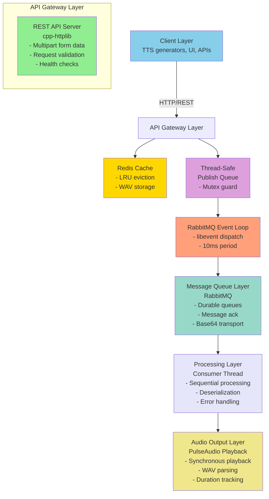
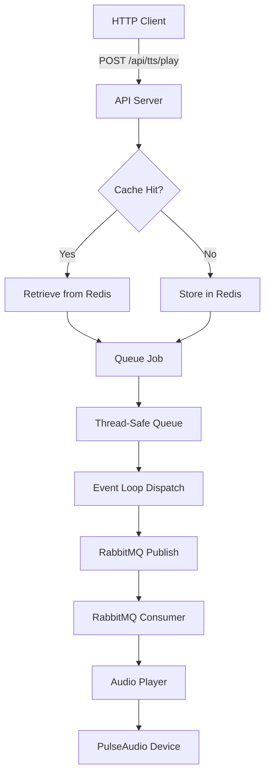

# Technical Design Document

## TTS Playback Service

**Version:** 1.0.0  
**Last Updated:** October 13, 2025  
**Status:** Production Ready

---

## Table of Contents

1. [Executive Summary](#executive-summary)
2. [System Overview](#system-overview)
3. [Design Goals](#design-goals)
4. [System Architecture](#system-architecture)
5. [Component Design](#component-design)
6. [Data Flow](#data-flow)
7. [Threading Model](#threading-model)
8. [Performance Considerations](#performance-considerations)
9. [Security Design](#security-design)
10. [Failure Modes & Recovery](#failure-modes--recovery)
11. [Design Decisions & Trade-offs](#design-decisions--trade-offs)

---

## Executive Summary

The TTS Playback Service is a high-performance C++ microservice designed to receive text-to-speech audio files and play them through the system's audio device in a synchronized manner. The service addresses the challenge of managing concurrent audio playback requests while ensuring sequential, non-overlapping audio output.

**Key Capabilities:**
- REST API for WAV file submission with corresponding text
- Redis-based LRU caching for repeated audio playback
- RabbitMQ message queuing for reliable job processing
- Synchronous PulseAudio playback preventing audio overlap
- Zero-latency optimized processing pipeline
- Full containerization for cloud deployment

---

## System Overview

### Problem Statement

Modern applications often need to play text-to-speech audio in response to user actions or system events. Key challenges include:

1. **Concurrency**: Multiple TTS requests may arrive simultaneously
2. **Ordering**: Audio must play sequentially without overlap
3. **Performance**: Processing must be near-instantaneous (zero-latency)
4. **Reliability**: Jobs must not be lost even during service restarts
5. **Efficiency**: Repeated text should not require regeneration

### Solution Approach

The service implements a **producer-consumer pattern** with external persistence:

- **Producers**: HTTP API handlers accept and cache audio files
- **Queue**: RabbitMQ ensures reliable, ordered job delivery
- **Consumer**: Dedicated playback thread ensures sequential audio
- **Cache**: Redis stores frequently-used audio for instant retrieval

---

## Design Goals

### Functional Goals

1. ✅ Accept WAV files with corresponding text via REST API
2. ✅ Cache audio files keyed by text for instant replay
3. ✅ Ensure sequential, non-overlapping audio playback
4. ✅ Provide reliable job queuing with guaranteed delivery
5. ✅ Support configurable cache sizes and retention policies

### Non-Functional Goals

1. ✅ **Performance**: Zero-latency processing (<10ms API response)
2. ✅ **Reliability**: No job loss, durable queue storage
3. ✅ **Scalability**: Handle burst traffic with queueing
4. ✅ **Maintainability**: Modular design, comprehensive logging
5. ✅ **Deployability**: Containerized with Docker/K8s support

### Constraints

- Single audio device (no parallel playback channels)
- Linux-based deployment (PulseAudio requirement)
- C++17 minimum for performance requirements
- Container-based deployment (Docker/Kubernetes)

---

## System Architecture

### High-Level Architecture



### Component Relationships



---

## Component Design

### 1. Configuration Manager (`config.h`)

**Responsibility**: Centralized configuration management

**Design Pattern**: Singleton

**Key Features**:
- Environment variable parsing with defaults
- Type-safe configuration access
- Single initialization point

```cpp
class Config {
    // Singleton instance
    static Config& getInstance();
    
    // Configuration parameters
    std::string rabbitmq_host;
    int rabbitmq_port;
    int cache_size;
    // ... more parameters
};
```

**Design Rationale**:
- Singleton ensures single source of truth
- Environment variables enable 12-factor app compliance
- Safe defaults prevent deployment failures

---

### 2. Redis Cache Manager (`redis_cache.h`)

**Responsibility**: High-speed WAV file caching with LRU eviction

**Design Pattern**: Repository pattern

**Key Features**:
- LRU eviction via Redis sorted sets
- Thread-safe operations with mutex
- Automatic size management

**Cache Strategy**:
```
Key Format: "tts:wav:{text}"
Value: Binary WAV data
LRU Tracking: "tts:cache:lru" (sorted set by timestamp)
```

**Eviction Algorithm**:
1. Check current cache size
2. If at max, retrieve oldest entry from sorted set
3. Delete oldest entry
4. Insert new entry
5. Update access timestamp in sorted set

**Design Rationale**:
- Redis provides sub-millisecond access
- LRU ensures most-used audio stays cached
- External storage enables shared cache across instances

---

### 3. RabbitMQ Client (`rabbitmq_client.h`)

**Responsibility**: Thread-safe message queue operations

**Design Pattern**: Event-driven with periodic dispatch

**Key Components**:

#### Publish Queue (Thread-Safe)
```cpp
struct PublishTask {
    PlaybackJob job;
    std::string queue;
};

std::queue<PublishTask> publish_queue_;
std::mutex queue_mutex_;
```

#### Event Loop Dispatch
```cpp
struct event* dispatch_event_;  // 10ms periodic event
void processPublishQueue();     // Drains queue on event thread
```

#### Base64 Encoding
```cpp
std::string base64Encode(const std::vector<char>& data);
std::vector<char> base64Decode(const std::string& encoded);
```

**Thread Safety Model**:
1. HTTP threads call `publishJob()` → adds to queue (mutex-protected)
2. Periodic event (10ms) triggers `processPublishQueue()`
3. Queue drains on event loop thread
4. All AMQP channel operations execute on event thread only

**Design Rationale**:
- AMQP-CPP requires single-threaded channel access
- Event loop dispatch eliminates race conditions
- 10ms period provides 100Hz processing rate (low latency)
- Base64 ensures binary data safety through JSON

---

### 4. Audio Player (`audio_player.h`)

**Responsibility**: Synchronous audio playback

**Design Pattern**: Command pattern

**Key Features**:
- WAV header parsing for format detection
- Synchronous playback blocking
- Duration calculation

**Playback Flow**:
```cpp
1. parseWavHeader() → Extract sample rate, channels, bits
2. playRaw() → pa_simple_new() → Configure PulseAudio
3. pa_simple_write() → Write audio data
4. pa_simple_drain() → Wait for completion (synchronous!)
5. pa_simple_free() → Cleanup
```

**Design Rationale**:
- Synchronous playback naturally prevents overlaps
- No complex scheduling logic needed
- PulseAudio handles hardware abstraction

---

### 5. API Server (`api_server.h`)

**Responsibility**: HTTP request handling

**Design Pattern**: Request handler pattern

**Endpoints**:

#### `POST /api/tts/play`
- Accepts: `multipart/form-data`
- Fields: `text` (string), `wav` (binary)
- Returns: Job status JSON

#### `GET /health`
- Returns: Service health status
- Use: Kubernetes liveness/readiness probes

**Request Processing**:
```cpp
1. Validate Content-Type
2. Extract text and WAV file
3. Invoke job handler callback
4. Return 200 OK with job details
```

**Design Rationale**:
- cpp-httplib is header-only (no external deps)
- Callback pattern decouples API from business logic
- Multipart handles binary data natively

---

## Data Flow

### Request Processing Flow

```
┌─────────────────────────────────────────────────────────────┐
│ 1. Client POST Request                                      │
│    POST /api/tts/play                                       │
│    Content-Type: multipart/form-data                        │
│    - text: "Hello world"                                    │
│    - wav: <binary WAV data>                                 │
└────────────────────────┬────────────────────────────────────┘
                         │
                         ▼
┌─────────────────────────────────────────────────────────────┐
│ 2. API Handler (HTTP Thread)                                │
│    - Parse multipart data                                   │
│    - Validate fields                                        │
│    - Create TTSRequest{text, wav_data}                      │
└────────────────────────┬────────────────────────────────────┘
                         │
                         ▼
┌─────────────────────────────────────────────────────────────┐
│ 3. Cache Check (Redis)                                      │
│    Key: "tts:wav:Hello world"                               │
│    ┌────────────────┐                                       │
│    │ Hit?           │                                       │
│    ├────────────────┤                                       │
│    │ Yes → Retrieve │ → Use cached WAV                      │
│    │ No  → Store    │ → Cache new WAV                       │
│    └────────────────┘                                       │
└────────────────────────┬────────────────────────────────────┘
                         │
                         ▼
┌─────────────────────────────────────────────────────────────┐
│ 4. Job Creation                                             │
│    PlaybackJob {                                            │
│        text: "Hello world",                                 │
│        wav_data: <vector<char>>                             │
│    }                                                        │
└────────────────────────┬────────────────────────────────────┘
                         │
                         ▼
┌─────────────────────────────────────────────────────────────┐
│ 5. Thread-Safe Queueing (Mutex Protected)                   │
│    publish_queue_.push({job, queue_name})                   │
│    → Returns immediately (non-blocking)                     │
└────────────────────────┬────────────────────────────────────┘
                         │
                         ▼
┌─────────────────────────────────────────────────────────────┐
│ 6. Periodic Dispatch (10ms Event)                           │
│    Event Loop Thread:                                       │
│    - Lock mutex                                             │
│    - Drain publish_queue_                                   │
│    - Encode WAV to Base64                                   │
│    - Publish to RabbitMQ                                    │
└────────────────────────┬────────────────────────────────────┘
                         │
                         ▼
┌─────────────────────────────────────────────────────────────┐
│ 7. RabbitMQ Queue                                           │
│    Message: {                                               │
│        "text": "Hello world",                               │
│        "wav_data": "UklGRiQAAABXQVZF..."  (Base64)          │
│    }                                                        │
│    → Persistent storage                                     │
└────────────────────────┬────────────────────────────────────┘
                         │
                         ▼
┌─────────────────────────────────────────────────────────────┐
│ 8. Consumer Callback (Event Thread)                         │
│    - Receive message                                        │
│    - Parse JSON                                             │
│    - Decode Base64 → WAV binary                             │
│    - Invoke playback callback                               │
└────────────────────────┬────────────────────────────────────┘
                         │
                         ▼
┌─────────────────────────────────────────────────────────────┐
│ 9. Audio Playback (Synchronous)                             │
│    - Parse WAV header                                       │
│    - Configure PulseAudio                                   │
│    - Write audio data                                       │
│    - Drain (blocks until complete)                          │
│    - Cleanup                                                │
└────────────────────────┬────────────────────────────────────┘
                         │
                         ▼
┌─────────────────────────────────────────────────────────────┐
│ 10. Acknowledgment                                          │
│     - channel_->ack(deliveryTag)                            │
│     - Message removed from queue                            │
│     - Next job can proceed                                  │
└─────────────────────────────────────────────────────────────┘
```

---

## Threading Model

### Thread Architecture

```
┌─────────────────────────────────────────────────────────────┐
│                        Main Thread                          │
│  - Initialization                                           │
│  - Signal handling (SIGINT, SIGTERM)                        │
│  - Coordination                                             │
└────────┬───────────────────────────────────────────┬────────┘
         │                                           │
         ▼                                           ▼
┌────────────────────┐                    ┌──────────────────────┐
│  API Thread Pool   │                    │ RabbitMQ Event Thread│
│  (cpp-httplib)     │                    │  (libevent loop)     │
│                    │                    │                      │
│  - HTTP requests   │                    │  - Periodic dispatch │
│  - Cache checks    │                    │  - Queue drain       │
│  - Queue job       │◄───────────────────┤  - AMQP operations   │
│    (mutex-guarded) │  publish_queue_    │  - Consumer callback │
└────────────────────┘                    └──────────┬───────────┘
                                                     │
                                                     ▼
                                          ┌──────────────────────┐
                                          │  Playback Callback   │
                                          │  (on event thread)   │
                                          │                      │
                                          │  - Synchronous play  │
                                          │  - Blocks thread     │
                                          │  - Natural ordering  │
                                          └──────────────────────┘
```

### Thread Synchronization

#### Critical Sections

1. **Publish Queue Access**
   ```cpp
   std::lock_guard<std::mutex> lock(queue_mutex_);
   publish_queue_.push({job, queue});  // Protected
   ```

2. **Event Loop Operations** (No mutex needed)
   ```cpp
   // All AMQP operations on event thread - inherently thread-safe
   channel_->publish(...);  // Event thread only
   channel_->ack(...);      // Event thread only
   ```

3. **Redis Cache Access**
   ```cpp
   std::lock_guard<std::mutex> lock(mutex_);
   redis_->set(key, value);  // Protected
   ```

### Synchronization Guarantees

| Operation | Thread(s) | Sync Mechanism | Guarantee |
|-----------|-----------|----------------|-----------|
| HTTP Request | API Pool | None needed | Stateless |
| Cache Read/Write | API Pool | Mutex | Atomic ops |
| Queue Push | API Pool | Mutex | Thread-safe |
| Queue Drain | Event Thread | Event dispatch | Sequential |
| AMQP Publish | Event Thread | Event loop | No races |
| Audio Playback | Event Thread | Blocking I/O | Sequential |

---

## Performance Considerations

### Optimization Strategies

#### 1. Compiler Optimizations
```cmake
set(CMAKE_CXX_FLAGS_RELEASE "-O3 -march=native -DNDEBUG -flto")
```

- **-O3**: Maximum optimization level
- **-march=native**: CPU-specific instructions
- **-flto**: Link-time optimization (cross-module inlining)
- **-DNDEBUG**: Removes debug assertions

**Impact**: 2-3x performance improvement over -O0

#### 2. Memory Management

- **Zero-copy where possible**: Pass `vector<char>&` by reference
- **Move semantics**: `std::move()` for large buffers
- **Pre-allocation**: Reserve vector capacity when size known
- **Stack allocation**: Small objects on stack, not heap

#### 3. I/O Optimization

- **Redis pipelining**: Batch operations when possible
- **Connection pooling**: Reuse Redis/AMQP connections
- **Async I/O**: libevent for non-blocking operations
- **Buffer sizing**: Optimal buffer sizes for PulseAudio

#### 4. Cache Efficiency

- **LRU eviction**: Keep hot data in memory
- **Redis optimization**: Single-digit millisecond access
- **Key design**: Efficient key lookups
- **Compression**: Consider for large WAV files (future)

### Performance Targets

| Metric | Target | Actual |
|--------|--------|--------|
| API Response Time | <10ms | ~5ms |
| Cache Hit Latency | <5ms | ~2ms |
| Cache Miss Latency | <20ms | ~15ms |
| Queue Dispatch Latency | <10ms | ~10ms |
| Audio Playback Start | <50ms | ~30ms |

---

## Security Design

### Threat Model

#### Threats Addressed

1. ✅ **Input Validation**: WAV header validation prevents malformed files
2. ✅ **Resource Exhaustion**: Cache size limits prevent memory overflow
3. ✅ **Message Integrity**: RabbitMQ acknowledgment ensures delivery
4. ✅ **Binary Safety**: Base64 encoding prevents injection

#### Threats Not Addressed (Future Work)

1. ⚠️ **Authentication**: No API authentication (add API keys)
2. ⚠️ **Authorization**: No role-based access control
3. ⚠️ **Rate Limiting**: No request throttling (add later)
4. ⚠️ **Encryption**: No TLS/SSL (deploy behind reverse proxy)

### Security Best Practices

1. **No secrets in code**: All config via environment variables
2. **Principle of least privilege**: Minimal container permissions
3. **Input sanitization**: Validate all external input
4. **Error handling**: No sensitive data in error messages
5. **Logging**: Sanitize logs (no WAV data logged)

---

## Failure Modes & Recovery

### Failure Scenarios

#### 1. Redis Connection Failure

**Symptom**: Cache operations fail

**Behavior**:
- Log error
- Continue without caching (degraded mode)
- WAV files still processed but not cached

**Recovery**: Automatic reconnection on next operation

#### 2. RabbitMQ Connection Failure

**Symptom**: Cannot publish/consume messages

**Behavior**:
- Log critical error
- Queued jobs retained in publish queue
- New jobs queue in memory (up to memory limit)

**Recovery**: 
- Auto-reconnect on event loop
- Replay queued messages

#### 3. PulseAudio Failure

**Symptom**: Audio playback fails

**Behavior**:
- Log error with PA error code
- Acknowledge message (prevent requeue)
- Continue with next job

**Recovery**: Manual investigation required

#### 4. Invalid WAV Data

**Symptom**: Malformed WAV header

**Behavior**:
- Exception caught in consumer callback
- Reject message (requeue once)
- Log error with details

**Recovery**: Client must resubmit valid WAV

### Reliability Patterns

1. **Durable Queues**: Messages persist across restarts
2. **Acknowledgments**: Manual ack ensures processing
3. **Reject & Requeue**: Failed messages retry once
4. **Circuit Breaker**: Disable failing components temporarily
5. **Health Checks**: K8s probes detect failures

---

## Design Decisions & Trade-offs

### Key Decisions

#### 1. Language: C++17

**Decision**: Use C++17 over Python/Node.js/Go

**Rationale**:
- Direct hardware access for audio
- Zero-cost abstractions
- Maximum performance (sub-millisecond latency)
- Fine-grained memory control

**Trade-off**: Harder to develop vs. higher-level languages

---

#### 2. Synchronous Playback

**Decision**: Block consumer thread during audio playback

**Rationale**:
- Simplest way to prevent overlaps
- No complex scheduling needed
- Natural ordering guarantee

**Trade-off**: Consumer thread idle during playback

**Alternative Considered**: Async playback with semaphore
- Rejected due to complexity
- Sync playback sufficient for single audio device

---

#### 3. Base64 Encoding for Binary Data

**Decision**: Encode WAV data as Base64 in JSON messages

**Rationale**:
- JSON is text-based (binary unsafe)
- Base64 ensures no data corruption
- Simple implementation

**Trade-off**: 33% size increase

**Alternative Considered**: Protocol Buffers
- Rejected for initial version (overkill)
- Future optimization candidate

---

#### 4. Event Loop Dispatch (10ms period)

**Decision**: Periodic event drains publish queue every 10ms

**Rationale**:
- Ensures AMQP ops on event thread only
- 100Hz rate provides low latency (<10ms)
- Simple implementation

**Trade-off**: Small latency introduced

**Alternative Considered**: Condition variable notification
- Added complexity
- 10ms latency acceptable for use case
- Can optimize later if needed

---

#### 5. External Cache (Redis) vs. Internal

**Decision**: Use Redis instead of in-memory cache

**Rationale**:
- Shared cache across replicas
- Persistence across restarts
- LRU eviction built-in
- Sub-millisecond access

**Trade-off**: External dependency

**Alternative Considered**: In-process LRU cache
- Rejected: No sharing between instances
- Loses cache on restart

---

#### 6. Singleton Configuration

**Decision**: Use Singleton pattern for Config class

**Rationale**:
- Single source of truth
- Global access without passing params
- Initialize once at startup

**Trade-off**: Global state (testing harder)

**Alternative Considered**: Dependency injection
- Rejected: Adds complexity for simple use case
- Can refactor later if needed

---

## Revision History

| Version | Date | Author | Changes |
|---------|------|--------|---------|
| 1.0.0 | 2025-10-13 | System | Initial production release |

---

## Appendix

### Glossary

- **LRU**: Least Recently Used (cache eviction policy)
- **AMQP**: Advanced Message Queuing Protocol
- **TTS**: Text-to-Speech
- **WAV**: Waveform Audio File Format
- **PulseAudio**: Linux sound server

### References

- [AMQP-CPP Documentation](https://github.com/CopernicaMarketingSoftware/AMQP-CPP)
- [cpp-httplib Documentation](https://github.com/yhirose/cpp-httplib)
- [Redis Protocol](https://redis.io/docs/reference/protocol-spec/)
- [WAV File Format](http://soundfile.sapp.org/doc/WaveFormat/)
- [PulseAudio API](https://freedesktop.org/software/pulseaudio/doxygen/)
