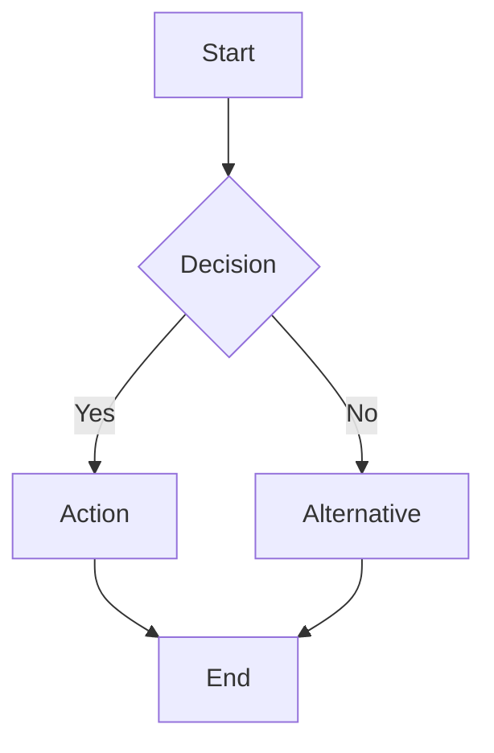
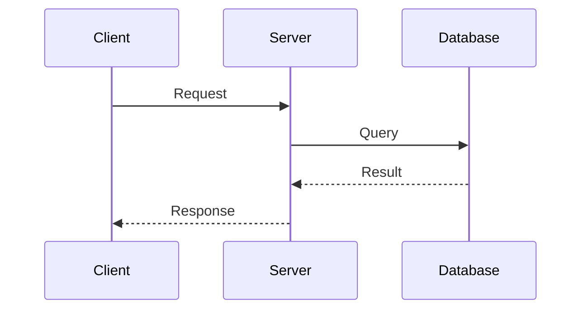
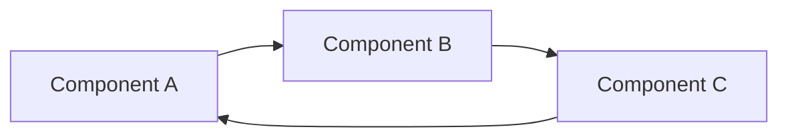

# Diagrams Index

All documentation now includes Mermaid diagrams for better visualization and readability.

## Test Documentation Diagrams

### Test Strategy (`TEST_STRATEGY.md`)
- ✅ Test Architecture (Current vs Target State)
- ✅ Component Test Strategy
- ✅ Test Distribution (Pie Chart)
- ✅ Test Dependencies Graph
- ✅ Test Execution Workflow (Sequence Diagram)
- ✅ Test Build Process (Flowchart)
- ✅ Test Execution State Machine
- ✅ Coverage Goals (Metrics)
- ✅ Test Categories (Mind Map)
- ✅ Critical Path Testing
- ✅ Unit Test Implementation Roadmap (Gantt Chart)
- ✅ Load Test Architecture
- ✅ CI/CD Pipeline (Flowchart)
- ✅ Pipeline Stages (State Diagram)
- ✅ Pre-Commit Checks (Flowchart)
- ✅ Test Data Management
- ✅ Test Metrics Collection (Flowchart)
- ✅ Test Health Score (Pie Chart)
- ✅ Risk Assessment (Quadrant Chart)

### Unit Testing Guide (`UNIT_TESTING_GUIDE.md`)
- ✅ Architecture Comparison (Current vs Target)
- ✅ Test Pyramid Evolution
- ✅ Refactoring Roadmap (Gantt Chart)

### Test README (`README.md`)
- ✅ Test Execution Flow (Flowchart)
- ✅ Test Architecture (Dependency Graph)
- ✅ Test Distribution (Pie Chart)

## Main Documentation Diagrams

### README.md
- ✅ Architecture Flowchart
- ✅ Thread Safety Sequence Diagram
- ✅ Test Distribution (Pie Chart)

### Architecture Guide (`docs/technical/ARCHITECTURE.md`)
- ✅ System Context Diagram
- ✅ Component Diagram (Layered Architecture)
- ✅ Infrastructure Layer
- ✅ Component Dependencies Graph
- ✅ Data Flow Sequence Diagram

### Design Document (`docs/technical/DESIGN.md`)
- ✅ High-Level Architecture Flowchart
- ✅ Component Relationships Graph

## Diagram Types Used

### Flowcharts
- System architecture
- Process flows
- Decision trees
- Data pipelines

### Sequence Diagrams
- Thread interactions
- API request flows
- Message passing
- Event sequences

### State Diagrams
- Test execution states
- Workflow states
- System states

### Gantt Charts
- Implementation roadmaps
- Timeline planning
- Phase planning

### Graphs & Trees
- Component dependencies
- Data relationships
- System hierarchies

### Charts
- Pie charts for distributions
- Quadrant charts for risk assessment
- Mind maps for categorization

## Benefits of Mermaid Diagrams

1. **Version Control**: Text-based diagrams in Git
2. **Maintainability**: Easy to update and modify
3. **Consistency**: Uniform styling across documentation
4. **Accessibility**: Renders in GitHub, GitLab, and most markdown viewers
5. **Integration**: Works with documentation generators
6. **Scalability**: Handles complex diagrams well

## Viewing Diagrams

### GitHub/GitLab
Diagrams render automatically in markdown preview

### Local Viewing
- Use VSCode with Mermaid extension
- Use markdown preview in IDEs
- Use online Mermaid live editor: https://mermaid.live

### CI/CD Integration
Diagrams can be rendered to images during build:
```bash
mmdc -i diagram.md -o diagram.png
```

## Diagram Guidelines

When adding new diagrams:

1. **Choose appropriate type**: Match diagram type to content
2. **Keep it simple**: Focus on clarity over complexity
3. **Use consistent colors**: Follow the color scheme
4. **Add labels**: Clear node and edge labels
5. **Document purpose**: Explain what the diagram shows

### Color Scheme

- `#87CEEB` (Sky Blue): API/Interface layers
- `#90EE90` (Light Green): Success states, primary components
- `#FFD700` (Gold): Configuration, settings
- `#DDA0DD` (Plum): Queues, async components
- `#FFA07A` (Light Salmon): Event processing
- `#98D8C8` (Medium Aquamarine): Infrastructure
- `#E6E6FA` (Lavender): Processing layers
- `#F0E68C` (Khaki): Output layers
- `#FFB6C1` (Light Pink): Error states
- `#87CEEB` (Light Blue): Future/planned items

## Quick Reference

### Common Mermaid Syntax







For more syntax: https://mermaid.js.org/intro/
