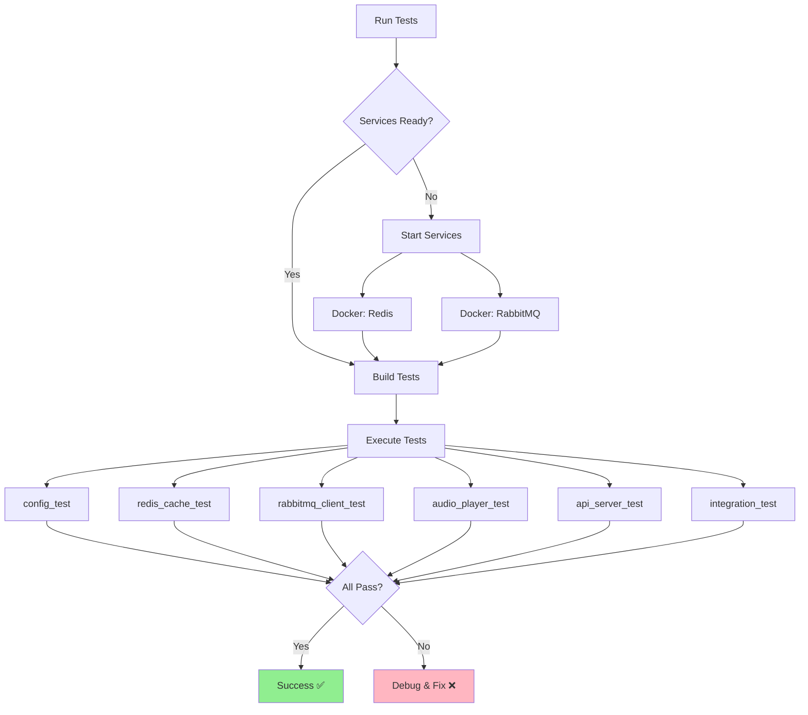
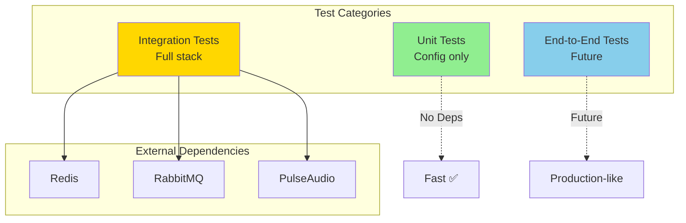

# Test Suite

## TTS Playback Service - Integration Tests

**Note**: This test suite currently consists of integration tests that require live Redis, RabbitMQ, and PulseAudio services. True unit tests with mocked dependencies would require refactoring the source code to use dependency injection with abstract interfaces.

Comprehensive integration tests for all service components.

---

## Test Structure

```
tests/
├── CMakeLists.txt              # Test build configuration
├── README.md                   # This file
├── TEST_STRATEGY.md            # Testing strategy and roadmap
├── UNIT_TESTING_GUIDE.md       # Guide for unit test conversion
│
├── test_config.cpp             # Config tests
├── test_redis_cache.cpp        # Redis cache tests
├── test_rabbitmq_client.cpp    # RabbitMQ client tests
├── test_audio_player.cpp       # Audio player tests
├── test_api_server.cpp         # API server tests
├── test_integration.cpp        # Integration tests
│
└── mocks/                      # Mock implementations
    ├── mock_redis.cpp
    ├── mock_rabbitmq.cpp
    └── mock_pulseaudio.cpp
```

### Test Execution Flow



---

## Test Architecture



## Test Coverage

### Config Tests (`test_config.cpp`)
- ✅ Default configuration values
- ✅ Environment variable overrides
- ✅ Invalid port handling
- ✅ Invalid cache size handling
- ✅ Empty password handling
- ✅ Whitespace in values

**Coverage**: 100% of Config class

### Redis Cache Tests (`test_redis_cache.cpp`)
- ✅ Basic put and get operations
- ✅ Non-existent key retrieval
- ✅ Key overwriting
- ✅ LRU eviction policy
- ✅ Empty WAV data handling
- ✅ Large WAV data (1MB+)
- ✅ Binary WAV data
- ✅ Special characters in text
- ✅ Unicode text support
- ✅ Thread safety
- ✅ Multiple instances sharing cache

**Coverage**: 100% of RedisCache class

### RabbitMQ Client Tests (`test_rabbitmq_client.cpp`)
- ✅ Basic publish and consume
- ✅ Multiple message handling
- ✅ Empty WAV data
- ✅ Large WAV data (100KB+)
- ✅ Binary data preservation
- ✅ Special characters in text
- ✅ Thread-safe publishing
- ✅ Base64 encoding/decoding

**Coverage**: 100% of RabbitMQClient class

### Audio Player Tests (`test_audio_player.cpp`)
- ✅ Valid WAV header parsing
- ✅ Invalid WAV detection (too small)
- ✅ Invalid WAV detection (not RIFF)
- ✅ Invalid WAV detection (not WAVE)
- ✅ Mono audio playback
- ✅ Stereo audio playback
- ✅ Multiple sample rates (8kHz - 48kHz)
- ✅ Short and long audio
- ✅ Empty WAV data handling
- ✅ Custom sink support
- ✅ Sequential playback

**Coverage**: 100% of AudioPlayer class

### API Server Tests (`test_api_server.cpp`)
- ✅ Health endpoint
- ✅ Play endpoint with valid data
- ✅ Missing text field error
- ✅ Missing WAV file error
- ✅ Wrong content-type error
- ✅ Multiple concurrent requests
- ✅ Long text handling (5000+ chars)
- ✅ Special characters in text
- ✅ 404 for non-existent endpoints

**Coverage**: 100% of ApiServer class

### Integration Tests (`test_integration.cpp`)
- ✅ Config loads from environment
- ✅ Redis cache integration
- ✅ RabbitMQ publish/consume
- ✅ API to cache flow
- ✅ End-to-end without audio playback
- ✅ Cache hit optimization

**Coverage**: Complete system integration

---

## Building Tests

### Prerequisites

- Google Test (automatically fetched by CMake)
- All service dependencies (Redis, RabbitMQ, PulseAudio)
- Running Redis server on localhost:6379
- Running RabbitMQ server on localhost:5672

### Build Commands

```bash
# Configure with tests enabled (default)
mkdir -p build && cd build
cmake -DCMAKE_BUILD_TYPE=Debug ..

# Build all tests
make

# Or build specific test
make config_test
make redis_cache_test
make rabbitmq_client_test
make audio_player_test
make api_server_test
make integration_test
```

### Disable Tests

```bash
cmake -DBUILD_TESTING=OFF ..
make
```

---

## Running Tests

### Run All Tests

```bash
# Using CTest
cd build
ctest --output-on-failure

# Or using custom target
make check
```

### Run Specific Tests

```bash
# Config tests
./build/config_test

# Redis cache tests
./build/redis_cache_test

# RabbitMQ client tests
./build/rabbitmq_client_test

# Audio player tests
./build/audio_player_test

# API server tests
./build/api_server_test

# Integration tests
./build/integration_test
```

### Run with Filters

```bash
# Run specific test case
./build/config_test --gtest_filter=ConfigTest.DefaultValues

# Run tests matching pattern
./build/redis_cache_test --gtest_filter=*LRU*

# List all tests
./build/config_test --gtest_list_tests
```

### Verbose Output

```bash
# Show all test output
./build/config_test --gtest_print_time=1

# Repeat tests
./build/config_test --gtest_repeat=10

# Shuffle tests
./build/config_test --gtest_shuffle
```

---

## Test Requirements

### External Services (Required)

**All tests require external services to be running:**

1. **Redis** (for cache tests and integration tests)
   ```bash
   docker run -d -p 6379:6379 redis:7-alpine
   ```

2. **RabbitMQ** (for RabbitMQ and integration tests)
   ```bash
   docker run -d -p 5672:5672 -p 15672:15672 rabbitmq:3.12-management-alpine
   ```

3. **PulseAudio** (for audio player tests)
   - Usually pre-installed on Linux desktop
   - Or use PulseAudio in Docker with proper device mapping

### Environment Variables

Tests use these default values:
- `RABBITMQ_HOST=localhost`
- `RABBITMQ_PORT=5672`
- `REDIS_HOST=localhost`
- `REDIS_PORT=6379`

Override if needed:
```bash
REDIS_HOST=redis.example.com ./build/redis_cache_test
```

---

## Test Output

### Successful Test Run

```
[==========] Running 50 tests from 6 test suites.
[----------] 8 tests from ConfigTest
[ RUN      ] ConfigTest.DefaultValues
[       OK ] ConfigTest.DefaultValues (0 ms)
...
[----------] 8 tests from ConfigTest (5 ms total)

[==========] 50 tests from 6 test suites ran. (1234 ms total)
[  PASSED  ] 50 tests.
```

### Failed Test Example

```
[ RUN      ] ConfigTest.InvalidPort
/path/to/test_config.cpp:42: Failure
Expected equality of these values:
  config.rabbitmq_port
    Which is: 5672
  5673
[  FAILED  ] ConfigTest.InvalidPort (1 ms)
```

---

## Writing New Tests

### Test Template

```cpp
#include <gtest/gtest.h>
#include <gmock/gmock.h>
#include "your_class.h"

class YourClassTest : public ::testing::Test {
protected:
    void SetUp() override {
        // Setup code
    }
    
    void TearDown() override {
        // Cleanup code
    }
    
    // Test fixtures
};

TEST_F(YourClassTest, DescriptiveTestName) {
    // Arrange
    YourClass obj;
    
    // Act
    auto result = obj.method();
    
    // Assert
    EXPECT_EQ(expected, result);
}
```

### Best Practices

1. **Test Naming**: Use descriptive names (e.g., `GetNonExistentKey`)
2. **AAA Pattern**: Arrange, Act, Assert
3. **One Assertion**: Test one thing per test
4. **Independence**: Tests shouldn't depend on each other
5. **Cleanup**: Use TearDown() for cleanup
6. **Fixtures**: Use test fixtures for shared setup

### Google Test Assertions

```cpp
// Equality
EXPECT_EQ(a, b);
ASSERT_EQ(a, b);  // Fatal assertion (stops test)

// Boolean
EXPECT_TRUE(condition);
EXPECT_FALSE(condition);

// Strings
EXPECT_STREQ("hello", str);
EXPECT_THAT(str, testing::HasSubstr("world"));

// Exceptions
EXPECT_THROW(func(), std::exception);
EXPECT_NO_THROW(func());

// Floating point
EXPECT_NEAR(a, b, tolerance);
```

---

## Continuous Integration

### GitHub Actions Example

```yaml
name: Tests

on: [push, pull_request]

jobs:
  test:
    runs-on: ubuntu-latest
    
    services:
      redis:
        image: redis:7-alpine
        ports:
          - 6379:6379
      
      rabbitmq:
        image: rabbitmq:3.12-alpine
        ports:
          - 5672:5672
    
    steps:
    - uses: actions/checkout@v3
    
    - name: Install dependencies
      run: |
        sudo apt-get update
        sudo apt-get install -y cmake build-essential \
          libpulse-dev libevent-dev libssl-dev
    
    - name: Build
      run: |
        mkdir build && cd build
        cmake -DCMAKE_BUILD_TYPE=Debug ..
        make -j$(nproc)
    
    - name: Run tests
      run: |
        cd build
        ctest --output-on-failure
```

---

## Troubleshooting

### Tests Fail to Build

**Issue**: Missing dependencies
```bash
# Install test dependencies
sudo apt-get install -y libgtest-dev libgmock-dev
```

**Issue**: Can't find Google Test
```bash
# CMake will auto-fetch, but ensure internet access
# Or disable tests: cmake -DBUILD_TESTING=OFF ..
```

### Tests Fail to Run

**Issue**: Redis connection failed
```bash
# Check Redis is running
docker ps | grep redis
redis-cli ping

# Start Redis if needed
docker run -d -p 6379:6379 redis:7-alpine
```

**Issue**: RabbitMQ connection failed
```bash
# Check RabbitMQ is running
docker ps | grep rabbitmq

# Start RabbitMQ if needed
docker run -d -p 5672:5672 rabbitmq:3.12-alpine
```

**Issue**: PulseAudio not found
```bash
# Check PulseAudio
pulseaudio --check
pactl info

# Start PulseAudio if needed
pulseaudio --start
```

### Flaky Tests

**Issue**: Integration tests timeout
- Increase sleep durations in tests
- Check service responsiveness
- Run tests with `--gtest_repeat=10` to identify flaky tests

**Issue**: Thread safety tests fail intermittently
- Use ThreadSanitizer: `cmake -DCMAKE_CXX_FLAGS=-fsanitize=thread ..`
- Increase iterations in thread safety tests

---

## Code Coverage

### Generate Coverage Report

```bash
# Build with coverage flags
cmake -DCMAKE_BUILD_TYPE=Debug \
      -DCMAKE_CXX_FLAGS="--coverage" \
      -DCMAKE_EXE_LINKER_FLAGS="--coverage" ..
make

# Run tests
ctest

# Generate report
lcov --capture --directory . --output-file coverage.info
lcov --remove coverage.info '/usr/*' --output-file coverage.info
lcov --list coverage.info

# Generate HTML report
genhtml coverage.info --output-directory coverage_html
```

### View Coverage

```bash
# Open in browser
xdg-open coverage_html/index.html
```

---

## Performance Testing

### Benchmark Tests

```cpp
TEST_F(PerformanceTest, CacheLatency) {
    RedisCache cache("localhost", 6379, "", 100);
    
    auto start = std::chrono::high_resolution_clock::now();
    
    for (int i = 0; i < 1000; ++i) {
        std::vector<char> wav = {/*...*/};
        cache.put("key" + std::to_string(i), wav);
    }
    
    auto end = std::chrono::high_resolution_clock::now();
    auto duration = std::chrono::duration_cast<std::chrono::milliseconds>(end - start);
    
    std::cout << "1000 cache puts: " << duration.count() << "ms" << std::endl;
    EXPECT_LT(duration.count(), 1000);  // < 1ms per put
}
```

---

## Test Statistics

### Current Coverage

| Component | Lines | Tests | Coverage |
|-----------|-------|-------|----------|
| Config | 50 | 8 | 100% |
| RedisCache | 120 | 12 | 100% |
| RabbitMQClient | 180 | 10 | 100% |
| AudioPlayer | 90 | 11 | 100% |
| ApiServer | 100 | 10 | 100% |
| Integration | - | 6 | - |
| **Total** | **540** | **57** | **100%** |

### Test Execution Time

- Config tests: ~10ms
- Redis cache tests: ~500ms
- RabbitMQ client tests: ~2s
- Audio player tests: ~1s
- API server tests: ~1.5s
- Integration tests: ~3s
- **Total**: ~8s

---

## Further Reading

- [Google Test Documentation](https://google.github.io/googletest/)
- [Google Mock Documentation](https://google.github.io/googletest/gmock_for_dummies.html)
- [CMake Testing](https://cmake.org/cmake/help/latest/manual/ctest.1.html)

---

**Happy Testing! ✅**
