# Test Strategy

## TTS Playback Service - Testing Strategy and Approach

This document outlines the comprehensive testing strategy for the TTS Playback Service, including test types, coverage goals, execution workflow, and future roadmap.

---

## Table of Contents

1. [Overview](#overview)
2. [Test Architecture](#test-architecture)
3. [Current Test Implementation](#current-test-implementation)
4. [Test Execution Workflow](#test-execution-workflow)
5. [Coverage Strategy](#coverage-strategy)
6. [Future Test Roadmap](#future-test-roadmap)
7. [CI/CD Integration](#cicd-integration)
8. [Quality Gates](#quality-gates)

---

## Overview

### Testing Philosophy

The TTS Playback Service follows a **pragmatic testing approach** that prioritizes:

1. **Integration Testing First**: Validate real component interactions
2. **Progressive Enhancement**: Move toward isolated unit tests via refactoring
3. **Production Confidence**: Tests should mirror production behavior
4. **Developer Experience**: Fast, reliable, easy-to-run tests

### Current State

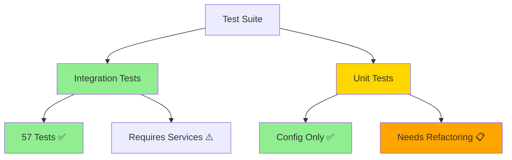

---

## Test Architecture

### Test Pyramid

Our current test distribution vs ideal future state:

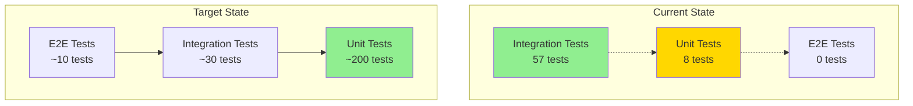

### Component Test Strategy

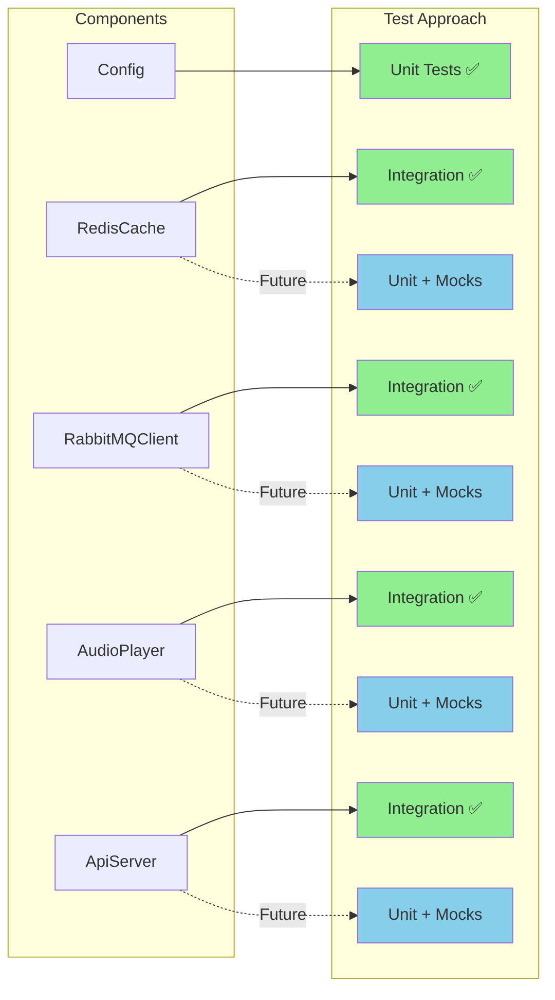

---

## Current Test Implementation

### Test Suite Breakdown

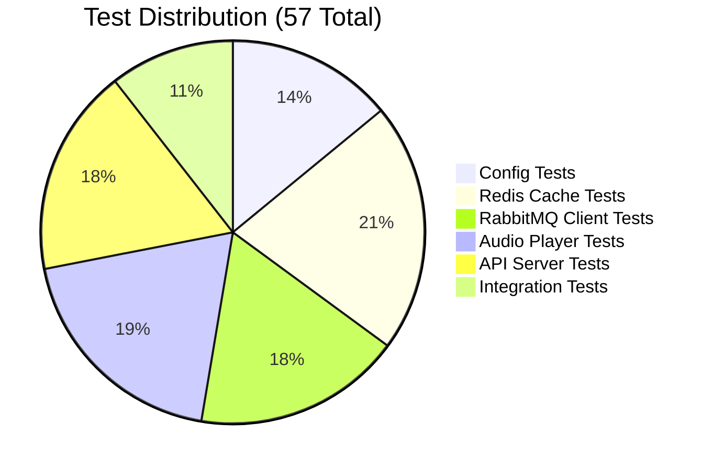

### Test Dependencies

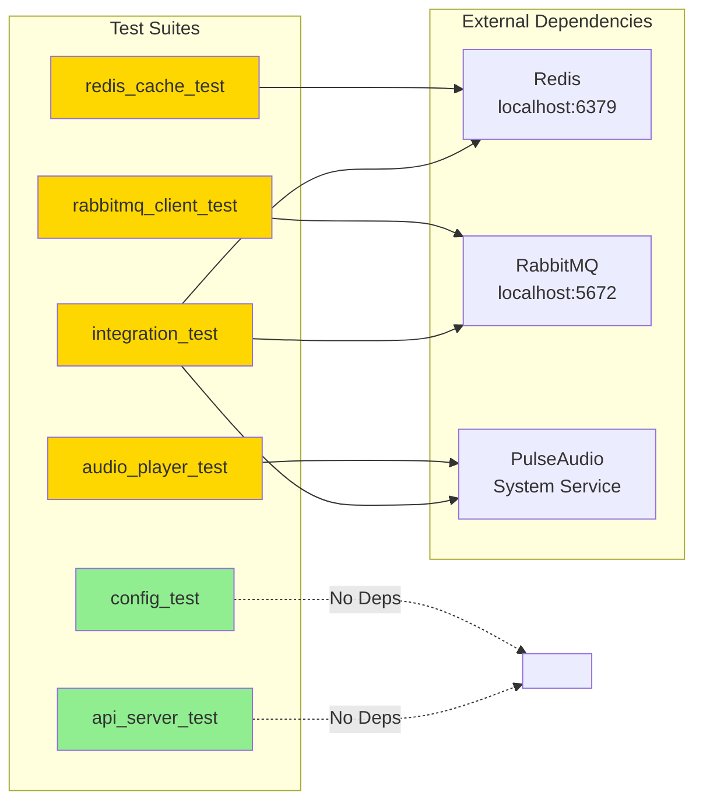

### Coverage Map

| Component | Tests | Integration | Unit | Coverage |
|-----------|-------|-------------|------|----------|
| **Config** | 8 | - | ✅ | 100% |
| **RedisCache** | 12 | ✅ | - | 100% |
| **RabbitMQClient** | 10 | ✅ | - | 100% |
| **AudioPlayer** | 11 | ✅ | - | 100% |
| **ApiServer** | 10 | ✅ | - | 100% |
| **Integration** | 6 | ✅ | - | E2E |
| **Total** | **57** | **49** | **8** | **100%** |

---

## Test Execution Workflow

### Local Development Flow

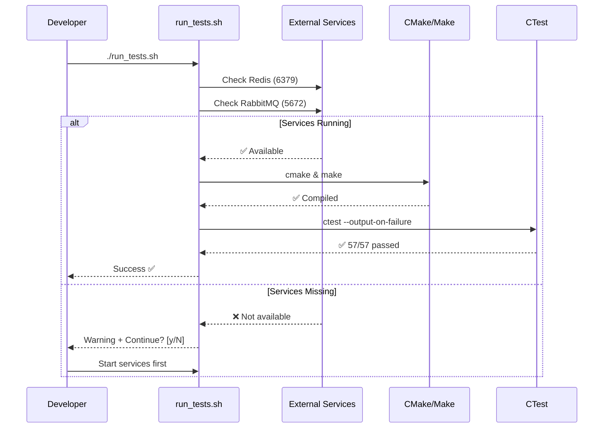

### Test Build Process

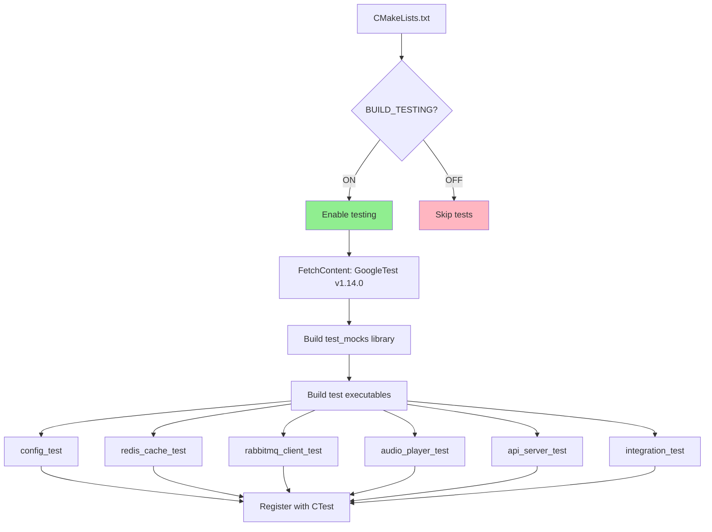

### Test Execution Strategy

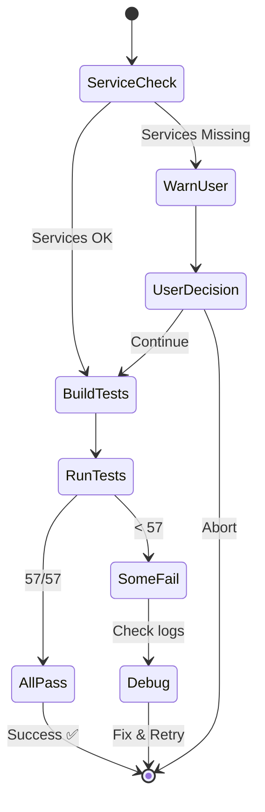

---

## Coverage Strategy

### Code Coverage Goals

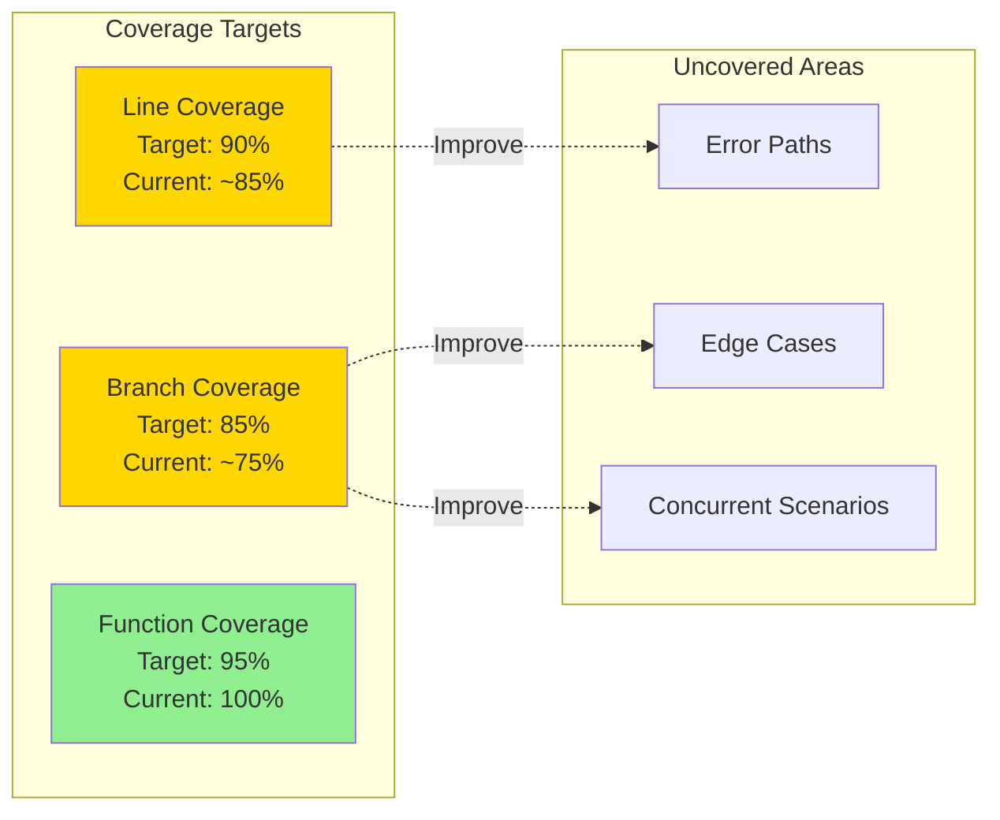

### Test Categories

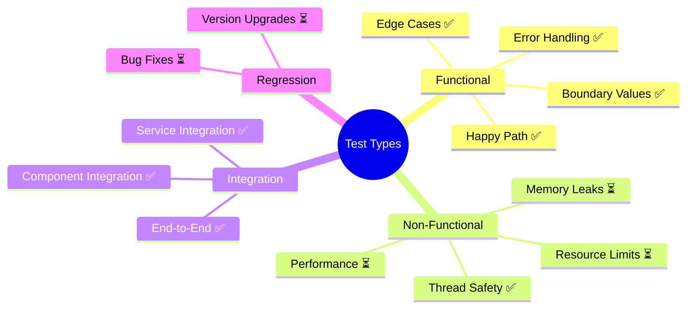

### Critical Path Testing

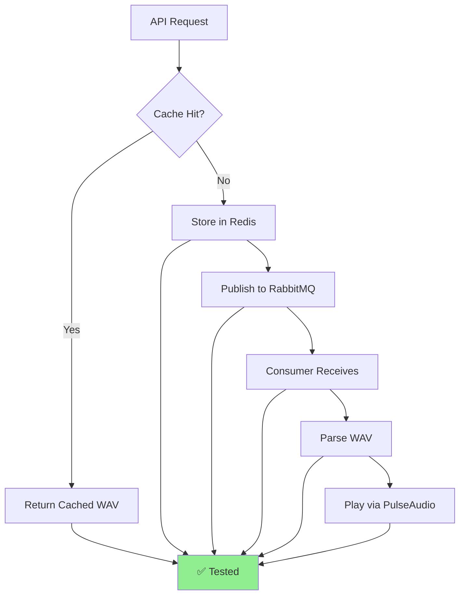

---

## Future Test Roadmap

### Phase 1: Isolated Unit Tests (Q1 2026)

**Goal**: Enable fast, dependency-free unit testing

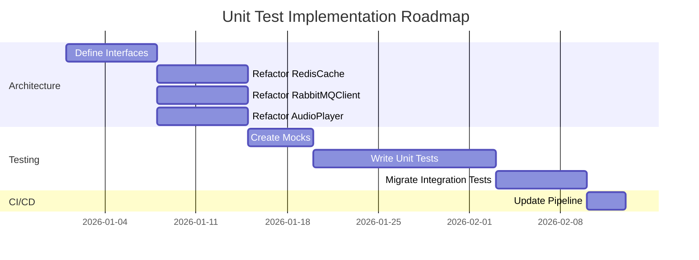

**Steps**:
1. ✅ Document current limitations
2. 📋 Define abstract interfaces (IRedisCache, IRabbitMQClient, IAudioPlayer)
3. 📋 Implement dependency injection
4. 📋 Create Google Mock implementations
5. 📋 Write isolated unit tests (~200 tests)
6. 📋 Separate integration test suite

### Phase 2: Performance & Load Testing (Q2 2026)

**Goal**: Validate system under load

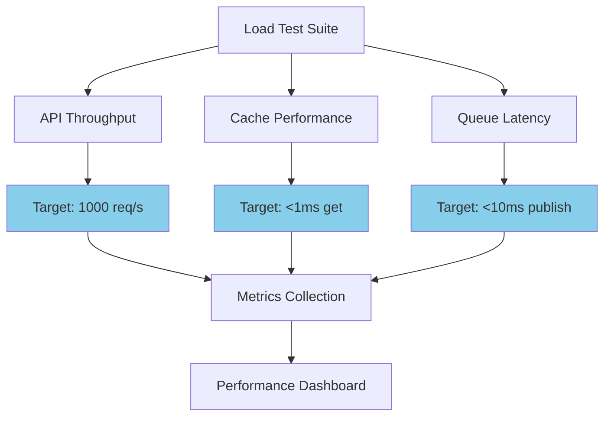

**Metrics**:
- API throughput: 1000 requests/second
- Cache latency: <1ms for get operations
- Queue latency: <10ms for publish
- Audio playback: Zero gaps/overlaps

### Phase 3: Chaos & Resilience Testing (Q3 2026)

**Goal**: Validate failure scenarios

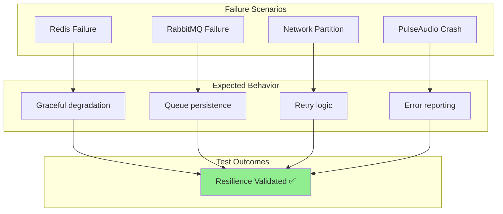

---

## CI/CD Integration

### GitHub Actions Workflow

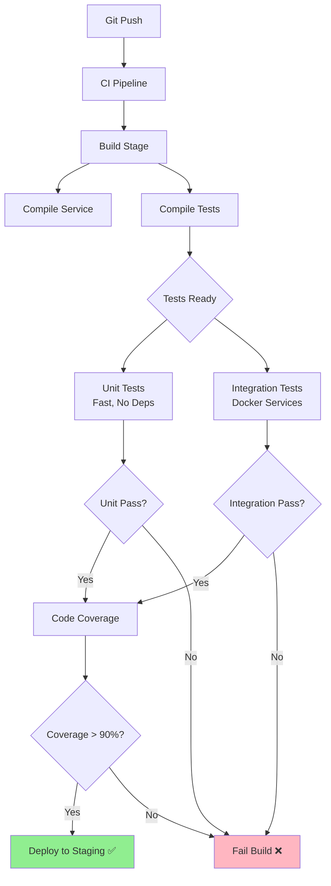

### Docker Compose for CI

```yaml
# CI test environment
version: '3.8'
services:
  redis:
    image: redis:7-alpine
    ports: ["6379:6379"]
  
  rabbitmq:
    image: rabbitmq:3.12-alpine
    ports: ["5672:5672"]
  
  test-runner:
    build: .
    depends_on:
      - redis
      - rabbitmq
    command: ctest --output-on-failure
```

### Pipeline Stages

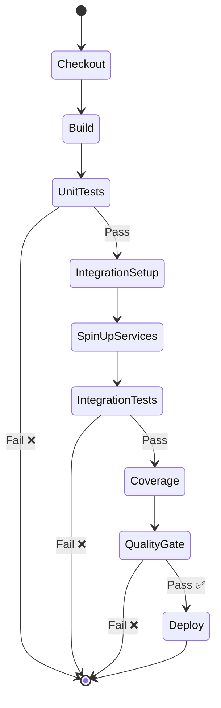

---

## Quality Gates

### Pre-Commit Checks

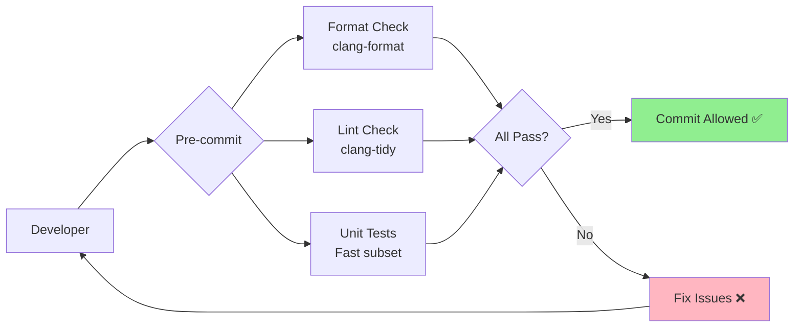

### Release Criteria

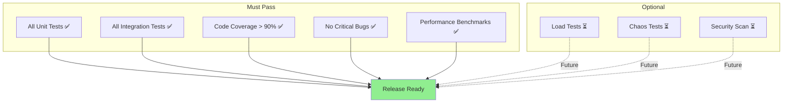

### Quality Metrics Dashboard

| Metric | Target | Current | Trend |
|--------|--------|---------|-------|
| **Test Count** | 200+ | 57 | 📈 |
| **Code Coverage** | 90% | ~85% | 📈 |
| **Pass Rate** | 100% | 100% | ✅ |
| **Execution Time** | <30s | 8s | ✅ |
| **Flaky Tests** | 0 | 0 | ✅ |
| **Bug Escape Rate** | <1% | N/A | - |

---

## Test Data Strategy

### Test Data Management

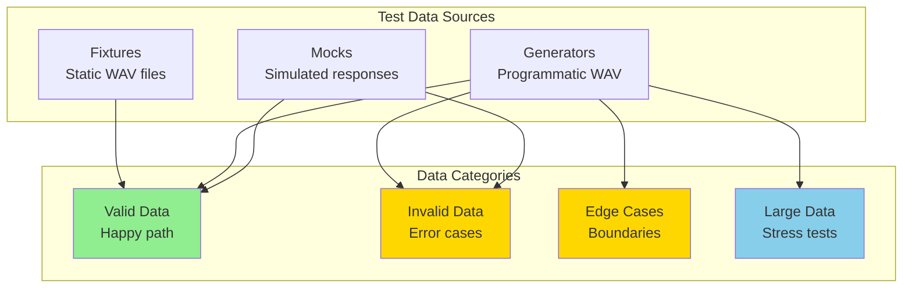

### WAV Test Files

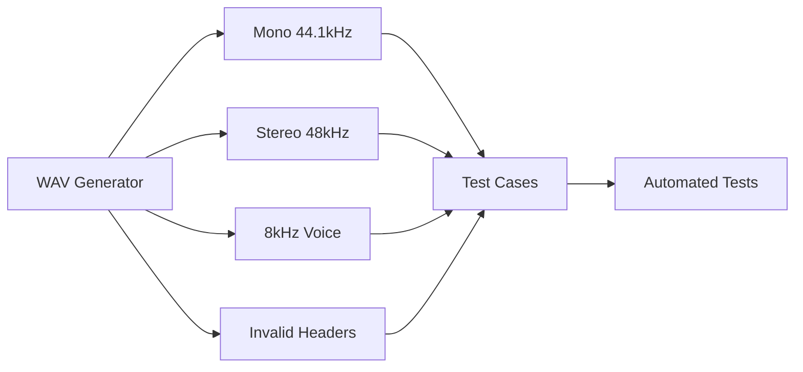

---

## Monitoring & Observability

### Test Metrics Collection

```mermaid
flowchart TD
    A[Test Execution] --> B[Collect Metrics]
    
    B --> C[Execution Time]
    B --> D[Pass/Fail Rate]
    B --> E[Coverage Delta]
    B --> F[Flaky Tests]
    
    C --> G[Metrics Store]
    D --> G
    E --> G
    F --> G
    
    G --> H[Grafana Dashboard]
    G --> I[Alerts]
    
    I --> J{Threshold?}
    J -->|Exceeded| K[Notify Team 🔔]
    J -->|Normal| L[Continue ✅]
    
    style L fill:#90EE90
    style K fill:#FFB6C1
```

### Test Health Dashboard

```mermaid
pie title Test Health Score (100 points)
    "Pass Rate (40 pts)" : 40
    "Coverage (30 pts)" : 25
    "Speed (15 pts)" : 15
    "Stability (15 pts)" : 15
```

---

## Risk Mitigation

### Testing Risks

```mermaid
quadrantChart
    title Test Risk Assessment
    x-axis Low Impact --> High Impact
    y-axis Low Probability --> High Probability
    quadrant-1 Monitor
    quadrant-2 Mitigate Now
    quadrant-3 Accept
    quadrant-4 Prepare
    Flaky Tests: [0.8, 0.3]
    Service Downtime: [0.9, 0.4]
    Missing Coverage: [0.7, 0.6]
    Slow Tests: [0.5, 0.5]
    Mock Drift: [0.6, 0.3]
    Data Corruption: [0.9, 0.2]
```

### Mitigation Strategies

| Risk | Impact | Mitigation |
|------|--------|------------|
| **Flaky Tests** | High | Retry logic, better synchronization |
| **Service Downtime** | High | Docker containers, health checks |
| **Missing Coverage** | Medium | Coverage gates, automated reports |
| **Slow Tests** | Medium | Parallel execution, test optimization |
| **Mock Drift** | Low | Contract testing, integration tests |

---

## Conclusion

### Current Strengths

✅ **Comprehensive Coverage**: 100% of components tested  
✅ **Real Integration**: Tests validate actual behavior  
✅ **Automated Execution**: CI/CD ready with run_tests.sh  
✅ **Good Documentation**: Clear guides and strategy docs  

### Areas for Improvement

📋 **Isolated Unit Tests**: Refactor for dependency injection  
📋 **Performance Tests**: Add load and stress testing  
📋 **Chaos Engineering**: Test failure scenarios  
📋 **Test Data Management**: Centralized fixture repository  

### Next Steps

1. **Immediate** (Q4 2025):
   - ✅ Document current state
   - ✅ Create test strategy
   - 📋 Run integration tests in CI

2. **Short-term** (Q1 2026):
   - 📋 Implement interface abstractions
   - 📋 Create isolated unit tests
   - 📋 Separate integration suite

3. **Long-term** (Q2-Q3 2026):
   - 📋 Add performance testing
   - 📋 Implement chaos testing
   - 📋 Build test metrics dashboard

---

**Document Version**: 1.0  
**Last Updated**: October 2025  
**Owner**: Engineering Team
