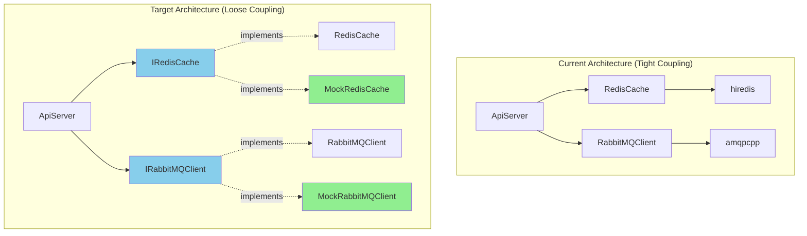
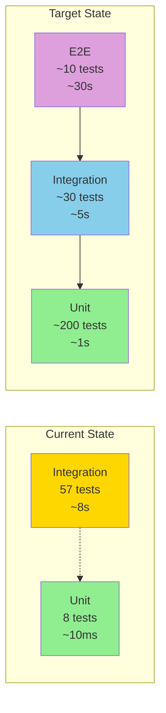
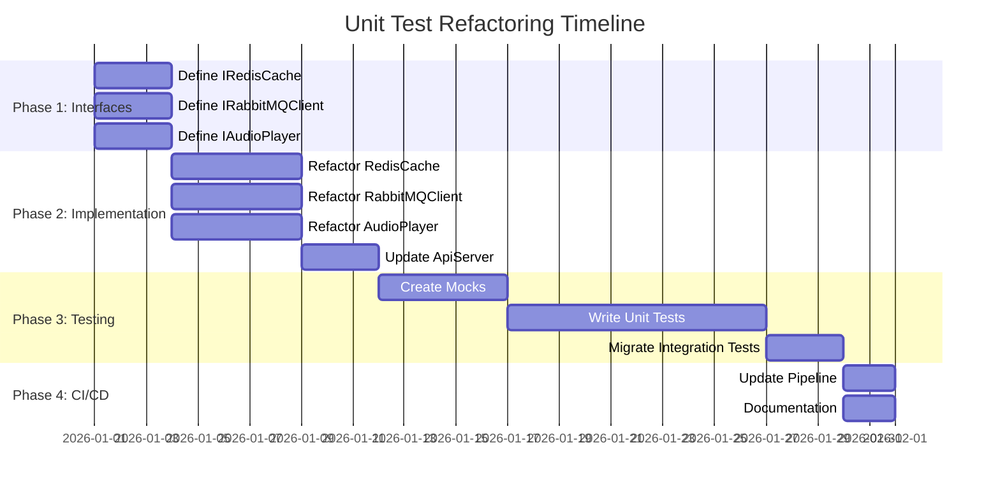

# Unit Testing Guide

## Current State: Integration Tests

The test suite currently consists of **integration tests** that require live external services (Redis, RabbitMQ, PulseAudio). This is because the service classes are concrete implementations without abstraction layers.

## Converting to True Unit Tests

To create proper isolated unit tests, the following refactoring would be required:

### 1. Create Abstract Interfaces

Define interfaces for all external dependencies:

```cpp
// include/interfaces/i_redis_cache.h
class IRedisCache {
public:
    virtual ~IRedisCache() = default;
    virtual void put(const std::string& key, const std::vector<char>& data) = 0;
    virtual bool get(const std::string& key, std::vector<char>& data) = 0;
};

// include/interfaces/i_rabbitmq_client.h
class IRabbitMQClient {
public:
    virtual ~IRabbitMQClient() = default;
    virtual void publishJob(const PlaybackJob& job) = 0;
};

// include/interfaces/i_audio_player.h
class IAudioPlayer {
public:
    virtual ~IAudioPlayer() = default;
    virtual void play(const std::vector<char>& wav_data) = 0;
};
```

### 2. Implement Interfaces in Existing Classes

Refactor existing classes to inherit from interfaces:

```cpp
// include/redis_cache.h
#include "interfaces/i_redis_cache.h"

class RedisCache : public IRedisCache {
public:
    RedisCache(const std::string& host, int port, const std::string& password, int cache_size);
    
    void put(const std::string& key, const std::vector<char>& data) override;
    bool get(const std::string& key, std::vector<char>& data) override;
    
private:
    // existing implementation
};
```

### 3. Use Dependency Injection

Modify classes to accept interface pointers:

```cpp
// include/api_server.h
class ApiServer {
public:
    ApiServer(
        const std::string& host, 
        int port,
        IRedisCache* cache,           // Interface instead of concrete class
        IRabbitMQClient* rabbitmq,     // Interface instead of concrete class
        std::function<void(const TTSRequest&)> callback
    );
    
private:
    IRedisCache* cache_;
    IRabbitMQClient* rabbitmq_;
};
```

### 4. Create Mock Implementations

Use Google Mock to create test doubles:

```cpp
// tests/mocks/mock_redis_cache.h
#include <gmock/gmock.h>
#include "interfaces/i_redis_cache.h"

class MockRedisCache : public IRedisCache {
public:
    MOCK_METHOD(void, put, (const std::string& key, const std::vector<char>& data), (override));
    MOCK_METHOD(bool, get, (const std::string& key, std::vector<char>& data), (override));
};
```

### 5. Write True Unit Tests

Test classes in isolation using mocks:

```cpp
// tests/unit/test_api_server.cpp
#include <gtest/gtest.h>
#include "api_server.h"
#include "mocks/mock_redis_cache.h"
#include "mocks/mock_rabbitmq_client.h"

TEST(ApiServerUnitTest, CacheHitSkipsPublish) {
    MockRedisCache cache;
    MockRabbitMQClient rabbitmq;
    
    std::vector<char> cached_wav = {'W', 'A', 'V'};
    
    // Expect cache hit
    EXPECT_CALL(cache, get("test", testing::_))
        .WillOnce(testing::DoAll(
            testing::SetArgReferee<1>(cached_wav),
            testing::Return(true)
        ));
    
    // Expect NO publish on cache hit
    EXPECT_CALL(rabbitmq, publishJob(testing::_))
        .Times(0);
    
    // Create server with mocks
    ApiServer server("localhost", 8080, &cache, &rabbitmq, [](const TTSRequest&){});
    
    // Test that cache hit prevents publish
    // ... make request ...
}
```

## Current Architecture Limitation

The current architecture has:
- **Tight coupling**: Classes directly instantiate dependencies
- **No abstraction**: Concrete classes instead of interfaces
- **No DI**: Dependencies created internally, not injected

This makes true unit testing impossible without:
1. Significant refactoring of source code
2. Breaking changes to class constructors
3. Adding interface layer throughout codebase

### Architecture Comparison



## Recommended Approach

**For Now**: Use integration tests (current state)
- Provides functional verification
- Tests real component interactions
- Requires external services but validates end-to-end behavior

**For Future**: Refactor to enable unit testing
- Add interface abstraction layer
- Implement dependency injection
- Create mock implementations
- Separate unit tests from integration tests

## Integration vs Unit Tests

| Aspect | Integration Tests (Current) | Unit Tests (Future) |
|--------|---------------------------|-------------------|
| **Dependencies** | Real Redis, RabbitMQ, PulseAudio | Mocks/fakes |
| **Speed** | Slower (~8 seconds) | Fast (<1 second) |
| **Isolation** | Tests multiple components | Single component |
| **Environment** | Requires services running | Runs anywhere |
| **CI/CD** | Needs Docker containers | Standalone |
| **Coverage** | End-to-end flows | Logic paths |
| **Value** | Validates integration | Validates logic |

### Test Pyramid Evolution



## Implementation Checklist

To convert to unit tests:

- [ ] Define interface classes (IRedisCache, IRabbitMQClient, IAudioPlayer)
- [ ] Refactor RedisCache to implement IRedisCache
- [ ] Refactor RabbitMQClient to implement IRabbitMQClient
- [ ] Refactor AudioPlayer to implement IAudioPlayer
- [ ] Add dependency injection to ApiServer
- [ ] Add dependency injection to main.cpp
- [ ] Create Google Mock implementations
- [ ] Write unit tests using mocks
- [ ] Move current tests to integration/ directory
- [ ] Update CMakeLists.txt for separate test suites
- [ ] Update CI to run unit tests without services

### Refactoring Roadmap



## Conclusion

The current test suite provides valuable **integration testing** but lacks **isolated unit testing**. Converting to true unit tests requires architectural changes that introduce abstraction and dependency injection throughout the codebase.

**Trade-off**: Integration tests validate real behavior but unit tests enable faster iteration and better CI/CD.
